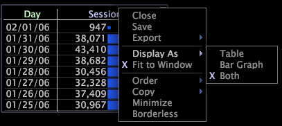

# Ändra tabellvisningen{#change-the-table-display}

Information för att välja visningstyp.

* Högerklicka på visualiseringens övre kant och klicka på något av följande alternativ:

   * **[!UICONTROL Display As]** > **[!UICONTROL Table]**

   * **[!UICONTROL Display As]** > **[!UICONTROL Bar Graph]**

   * **[!UICONTROL Display As]** > **[!UICONTROL Both]** (standard)
   

   Ett X visas till vänster om det aktiva visningsläget.

