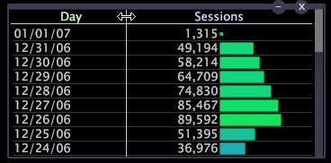

# Anpassa data till ett fönster{#fit-data-to-a-window}

{{eol}}

Med alternativet Anpassa till fönster kan datakolumnerna i en tabell automatiskt expanderas eller krympas för att passa fönstret varje gång du ändrar storlek på det.

När [!DNL Fit to Window] är inaktiverat måste du ändra storlek på datakolumnerna manuellt.

**Aktivera eller inaktivera alternativet Anpassa till fönster**

* Högerklicka på visualiseringens övre kant och klicka på **[!UICONTROL Fit to Window]**.

   

När det här alternativet är aktiverat visas ett X till vänster om [!DNL Fit to Window].

**Ändra storlek på datakolumner manuellt**

* Klicka på linjen som avgränsar två datakolumner (i det övre axelområdet) och dra till önskad bredd.

   
