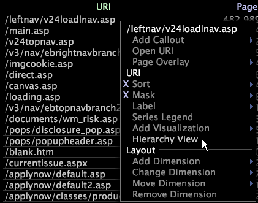

# Använd hierarkivyer{#apply-hierarchy-views}

{{eol}}

Hierarkivyer är bara tillgängliga när du använder programmet Plats eller HBX.

I hierarkivyn visas sidorna på en webbplats ordnade hierarkiskt efter filnamn och sorterade i bokstavsordning. Hierarkivyn är användbar för själva analysen, men du kan även använda den för att skapa avancerade visualiseringar som processkartor. Mer information om processkartor finns i [Processkartor](../../../../home/c-get-started/c-analysis-vis/c-proc-maps/c-proc-maps.md#concept-880aee224404429785b733a4e80d275e).

>[!NOTE]
>
>Om datauppsättningen har konfigurerats för att köras på flera servrar i ett kluster måste systemadministratören ange vilka datorfunktioner som ska fungera som central normaliseringsserver för att den här funktionen ska fungera korrekt. Anvisningar om hur du gör detta finns i kapitlet Loggbearbetningskonfigurationsfil i *Konfigurationshandbok för datauppsättning*.

**Aktivera eller inaktivera hierarkivyn**

* Högerklicka på ett element eller etiketten för siddimensionen från en sida eller URI-visualisering och klicka på **[!UICONTROL Hierarchy View]**.

   

   Ett X visas bredvid alternativet när [!DNL hierarchy view] är aktivt.

   Hierarkin är ordnad i webbplatsens avsnitt och sidor med hjälp av en trädstruktur. Avsnitt (noder) kan expanderas eller komprimeras med symbolen + eller - bredvid avsnittsnamnet. Enskilda sidor har inte en +- eller --symbol bredvid sig.

   

## Maskera element i Dimensionen i en hierarkisk vy {#section-e477c469934846da8d807f92fc2f3ed1}

Maskering avser att markera en delmängd av dina data eller en delmängd av elementen i en dimension. Du maskerar eller döljer de element som du inte vill ta med i analysen. Använda [!DNL Mask] menyalternativ för hierarkivvyer väljer du den lägsta procentandel av ett mätvärde som ett element måste visas i visualiseringen.

**Maskera data med [!DNL Mask] menyalternativ**

1. Högerklicka på ett element eller dimensionsetiketten och klicka på **[!UICONTROL Mask]**.

   

1. Klicka på ett procentvärde under Mer än och klicka sedan på det mätvärde som du vill maskera.

Om du till exempel klickar på 0,1 % och sedan klickar på Sidvyer, maskerar (döljer) du alla element som har mindre än 0,1 % av det totala antalet sidvyer och visar element som har mer än 0,1 % av det totala antalet sidvyer. Om du klickar på 0 % maskerar du alla element med värdet 0 (noll) för det valda måttet.
