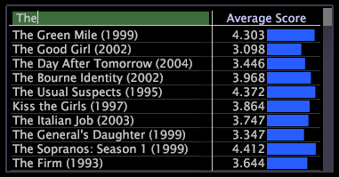

# Maskera data{#mask-data}

Maskering avser att markera en delmängd av dina data eller en delmängd av elementen i en dimension.

Du maskerar eller döljer de element som du inte vill ta med i analysen.

Data Workbench innehåller två metoder för att maskera dimensionselement. Den första metoden använder de alternativ som finns på [!DNL Mask]-menyn. Med menyalternativen [!DNL Mask] kan du använda musen för att markera de element som ska visas eller maskeras, eller så kan du visa element på den översta nivån när du sorterar data efter mätvärden. Den andra metoden för att maskera dimensionselement använder en sökning.

**Maskera data**

1. Högerklicka på ett element eller etiketten för den önskade dimensionen och klicka på **[!UICONTROL Mask]**.

   

1. Klicka på något av följande alternativ:

   * **[!UICONTROL Show all]**
   * **[!UICONTROL Show selected only]**
   * **[!UICONTROL Hide selected]**
   * **[!UICONTROL Show top > 5, 10, 25, 50, 100]** eller  **[!UICONTROL 500]** av de visade elementen sorterade efter mätvärden
   * **[!UICONTROL Show top > All Positive]** om du bara vill visa värden som är större än noll (0)
   * **[!UICONTROL Display “X more”]** för att visa antalet maskerade element
   * **[!UICONTROL At least one >]***&lt;>>*(endast tillgängligt när du arbetar med en normal dimension)**[!UICONTROL countable dimension name]**

      När du arbetar med en normal dimension kan du med det här alternativet maskera en dimension med en räkningsbar dimension. När du väljer det här alternativet visas endast de element som har minst ett element av den räkningsbara dimensionen som du har valt. Tabellen visar upp till 1 023 element.

>[!NOTE]
>
>Eftersom Adobe [!DNL Platform] bearbetar data i slumpmässig ordning, och minst en maskering ger mer än 1 023 element, har de vanligaste och större elementen större chans att inkluderas i tabellen.

När du maskerar med Visa överkant eller Minst en, motsvarar ordningen i tabellen som standard de värden som påverkas av markeringen vid den tidpunkten. Om du senare ändrar markeringen ändras inte ordningen från den ursprungliga ordningen om inte tabellen sorteras om eller du aktiverar Dynamisk markering. När du klickar på **[!UICONTROL Mask]** > **[!UICONTROL Dynamic Selection]** sorteras tabellen om varje gång du ändrar markeringen.

**Maskera data med hjälp av en sökning**

* Du kan maskera data med något av följande sökalternativ:

   * Högerklicka på ett element eller etiketten för den önskade dimensionen och klicka sedan på **[!UICONTROL Mask]** i rutan [!DNL Search] och skriv den fras som du vill söka efter.

      

   * Högerklicka på ett element eller etiketten för den önskade dimensionen, klicka på **[!UICONTROL Mask]** > **[!UICONTROL Display search bar]** och skriv sedan den fras du vill söka efter i sökrutan som visas i dimensionsetikettcellen.

      

      När du skriver in en sökfras uppdateras Datan Workbench så att matchningarna återspeglas.

Om du vill begränsa maskningen ytterligare under en sökning kan du använda någon av följande metoder:

* Du kan skriva &quot;re:&quot; i rutan eller fältet [!DNL search] om du vill att sökfrasen ska tolkas som ett reguljärt uttryck. Du kan använda vilken syntax som helst som är kopplad till reguljära uttryck i sökfrasen. Mer information om reguljära uttryck finns i bilagan Reguljärt uttryck i *Konfigurationshandboken för datauppsättningar*.
* Du kan skriva $-symbolen som det första tecknet i söksträngen för att hitta fraser som börjar med strängen du angav, eller som det sista tecknet för att hitta fraser som slutar med strängen du angav.
* Du kan skriva ett mellanslag som det första tecknet i söksträngen för att hitta ord i en fras som börjar med strängen du angav, eller som det sista tecknet för att hitta ord i en fras som slutar med strängen du angav.

Här följer exempel på olika sätt att maskera en tabell med strängen &quot;on&quot; i en sökning:

* När du skriver &quot;on&quot; visas alla fraser som innehåller strängen &quot;on&quot; var som helst i frasen: &quot;**on** linbanebanktjänster&quot; &quot;c **on** taktköpare&quot;, &quot;bulli **on** mynt&quot;, &quot;bank **on** line&quot;, &quot;guldopti **on** s&quot; och &quot;silverbulli **on**.&quot;
* Om du skriver &quot;$on&quot; visas alla fraser som börjar med strängen &quot;on&quot;:

   &quot;**on** linbanktjänster&quot; och &quot;**on**-linebetalning.&quot;

* Om du skriver &quot;on$&quot; visas alla fraser som slutar med strängen &quot;on&quot;:

   &quot;silverbulli **on**&quot; och &quot;guldopti **on**.&quot;

* Om du skriver &quot;on&quot; visas alla fraser som innehåller ett ord som börjar med strängen &quot;on&quot;:

   &quot;**on** line banktjänster&quot; och &quot;bank **on** line.&quot;

* Om du skriver &quot;on&quot; visas alla fraser som innehåller ett ord som slutar med strängen &quot;on&quot;:

   &quot;bulli **on** mynt&quot; och &quot;silverbulli **on**.&quot;

* Om du använder &quot;on&quot; visas alla fraser som innehåller strängen &quot;on&quot; som ett ord:

   &quot;**on** line bank&quot; och &quot;bank **on** line.&quot;
