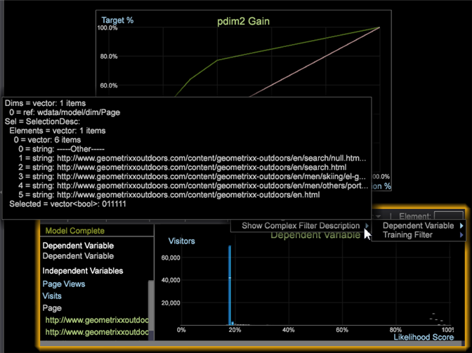

# Komplex filterbeskrivning{#complex-filter-description}

Du kan lägga till en Visa komplex filterbeskrivning för beroende variabler och för utbildningsfiltret.

Välj [!DNL Options > Show Complex Filter Description] från bedömningsdialogrutan till **[!UICONTROL Show the Complex Filter Description]**.

