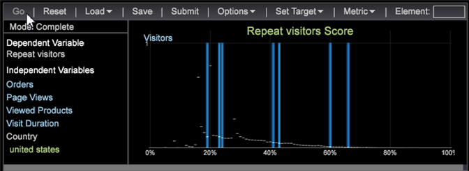

# Ställa in benägenhetsbedömning{#setting-up-propensity-scoring}

Följ de här stegen för att använda visualiseringen av förmånsbedömning.

1. Öppna en ny arbetsyta och klicka på **[!UICONTROL Add]** > **[!UICONTROL Visualization]** > **[!UICONTROL Predictive Analytics]** > **[!UICONTROL Scoring]** > **[!UICONTROL Propensity Score]**.

   

1. Ange **[!UICONTROL Target]** (den beroende variabeln).

   Ange den beroende variabeln genom att markera:

* **Dimensionselement**: Högerklicka på arbetsytan och välj **[!UICONTROL Table]**. Välj sedan ett Dimension-element som din beroende variabel.

   ELLER

* **[!UICONTROL Filter Editor]**. Klicka **[!UICONTROL Add]** > **[!UICONTROL Visualization]** > **[!UICONTROL Filter Editor]** för att öppna filterredigerarens visualisering.

   

   När du har valt ett dimensionselement eller filter som beroende variabel klickar du på **[!UICONTROL Set Target]** och anger ett namn som beskriver den beroende variabeln. Klicka sedan på **[!UICONTROL OK]** (och kontrollera att filterrutan är markerad) för att ange mål.

   

   Namnet som du ger målet är den beroende variabeln som visas i den vänstra rutan.
1. Lägg till oberoende variabler.

   Lägg till de oberoende variablerna med Metrisk eller Dimension Elements.

   

* **Mätvärden**. Välj ett mätvärde på **[!UICONTROL Metrics]** menyn i verktygsfältet Propensitetsbedömning.

* **Dimensionselement**: Högerklicka på arbetsytan och välj **[!UICONTROL Table]**. Markera ett eller flera dimensionselement och dra till den vänstra kolumnen under **[!UICONTROL Independent Variables]** eller till **[!UICONTROL Element]** rutan med `<Ctrl>` +- `<Alt>` tangenterna.

1. Ställ in **[!UICONTROL Training Filter]**. Du kan definiera den uppsättning besökare som du vill poängsätta genom att klicka **[!UICONTROL Options]** > **[!UICONTROL Set Training Filter]** i verktygsfältet Propensitetsbedömning. Detta ger en delmängd av data som byggts med enbart de besökare som du vill poängsätta. Exempel: besökare som besökt den senaste månaden, besökare som bor i Australien eller besökare som har tittat på specifika produkter.

   Standardfiltret är **[!UICONTROL Train on Everyone]** men du kan ändra det genom att aktivera **[!UICONTROL Dimension Elements]** i en tabell eller skapa ett filter med **[!UICONTROL Filter Editor]**.

   När du har valt ett dimensionselement eller skapat ett filter och aktiverat klickar du på **Alternativ** > **Ange utbildningsfilter**, anger ett namn som beskriver filtret och klickar sedan på **[!UICONTROL OK]**.
1. När du har identifierat alla dina indata, tryck **[!UICONTROL Go]**.

   

   Bedömningsprocessen börjar med att skicka data flera gånger. Resultatet visas sedan som stapeldiagram över en procentlinje.
1. Spara benägenhetspoäng.

   Från och med 6.1 har du nu ett alternativ när du använder Spara benägenhetspoäng:

* Dimension
* Mått och mått

   Du kan få två sparade filer, både en dimension och ett definierat mått.

   >[!NOTE]
   >
   >Om du skickar Propensity Score för bearbetning får du bara en dimension.

   Det härledda måttet är det associerade medelpoängsmåttet.
1. Kontrollera noggrannheten.

   Systemet visar **[!UICONTROL Model Complete]** och genererar en poängmodell när processen är klar.

   Om du högerklickar på **[!UICONTROL Model Complete]** identifieras poängmodellen som den definieras av systemet. Värden från 0 procent till 100 procent identifierar sannolikheten för att besökarna matchar **[!UICONTROL Target]** variabeln.

   Sammanfusionsmatrisen ger fyra tal genom kombinationen av Faktiskt positivt (AP), Faktiskt negativt (AN), Förutsagt positivt (PP) och Förutsagt negativt (PN). Dessa siffror erhålls genom att tillämpa den resulterande poängmodellen på de 20 %-testdata som vi vet det sanna svaret på. Om poängen är större än 50 % förutspås det som ett positivt fall (matcha den definierade händelsen).

   

<table id="table_154BDD6D294C4ED1B8C15EC33B74B199"> 
 <tbody> 
  <tr> 
   <td colname="col1"><b> Noggrannhet</b> </td> 
   <td colname="col2"> Anger hur korrekt modellen är genom att identifiera rätt prognoser för alla prognoser. 
(TP + TN)/(TP + FP + TN + FN) 
 </td> 
  </tr> 
  <tr> 
   <td colname="col1"><b> Återkalla</b> </td> 
   <td colname="col2"> Identifierar möjligheten att återidentifiera poängmodellen. 
<b>TP / (TP + FN)</b> 
 </td> 
  </tr> 
  <tr> 
   <td colname="col1"><b> Precision</b> </td> 
   <td colname="col2">Identifierar graden av diskrepans. 
TP / (TP + FP) 
 </td> 
  </tr> 
 </tbody> 
</table>

1. Öppna ett [lyft- eller magasin-schema](../../../../home/c-get-started/c-analysis-vis/c-visitor-propensity/c-propensity-gain-lift-chart.md#concept-0d049f6baf534f7fb97f271843ba6c4a)eller [modellvisaren](../../../../home/c-get-started/c-analysis-vis/c-visitor-propensity/c-propensity-model-viewer.md#concept-9f2593a8218140b7bd132a4c74e159f9).

   Högerklicka på visualiseringen **av modellen Complete** och välj **[!UICONTROL Lift Chart]**, **[!UICONTROL Gain Chart]** eller **[!UICONTROL Model Viewer.]**
