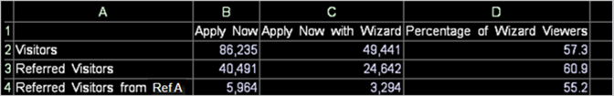

# Kalkylbladsuttryck{#worksheet-expressions}

{{eol}}

Konceptuell information om kalkylbladsuttryck och användning av cellreferenser.

Följande kalkylblad innehåller information om de besökare som visar programguidesidan som finns i onlineansökningsformuläret på en banks webbplats.

* Kolumn A visar en lista över de besökskategorier som utvärderas: besökare, refererade besökare och refererade besökare från hänvisande A.
* I kolumn B visas antalet besökare i varje kategori som visade sidan Använd nu.
* Kolumn C visar de besökare som har visat både Apply Now- och Application Wizard-sidorna.
* Kolumn D innehåller procentsatserna för Apply Now-visningsprogram i de tre kategorier som även visade sidan Application Wizard (Programguiden).

Kalkylbladet visar att ungefär 55 procent av de besökare som refereras från Referer A som visade sidan Använd nu också visade sidan Programguide.

I följande tabell visas exempelformler för kalkylbladet i föregående exempel:

<table id="table_0F5EFDB58040465AB599E6BE93324822"> 
 <thead> 
  <tr> 
   <th colname="col1" class="entry"> Kalkylbladscell </th> 
   <th colname="col2" class="entry"> Formel </th> 
  </tr> 
 </thead>
 <tbody> 
  <tr> 
   <td colname="col1"> 
B2 
 
Besökare som visade sidan Använd nu 
 </td> 
   <td colname="col2"> 
 =Besökare[Page="/applynow/default.asp"] 
 </td> 
  </tr> 
  <tr> 
   <td colname="col1"> 
B3 
 
Refererade besökare som visade sidan Använd nu 
 </td> 
   <td colname="col2"> 
 =Refererade_besökare[Page="/applynow/default.asp"] 
 </td> 
  </tr> 
  <tr> 
   <td colname="col1"> 
B4 
 
Refererade besökare från hänvisande A som visade sidan Använd nu 
 </td> 
   <td colname="col2"> 
  =Refererade_besökare[Page="/applynow/default.asp"  
 
 OCH  Referrer="Ref A"] 
 </td> 
  </tr> 
  <tr> 
   <td colname="col1"> 
C2 
 
Besökare som visade sidan Använd nu och sidan Programguiden 
 </td> 
   <td colname="col2"> 
  =Besökare[Page="/applynow/default.asp"  
 
 OCH  Page="/applynow/appwizard.asp"] 
 </td> 
  </tr> 
  <tr> 
   <td colname="col1"> 
C3 
 
Refererade besökare som visade sidan Använd nu och sidan Programguiden 
 </td> 
   <td colname="col2"> 
  =Refererade_besökare[Page="/applynow/default.asp"  
 
 OCH  Page="/applynow/appwizard.asp"] 
 </td> 
  </tr> 
  <tr> 
   <td colname="col1"> 
C4 
 
Refererade besökare från hänvisande A som visade sidan Använd nu och sidan för programguiden 
 </td> 
   <td colname="col2"> 
  =Refererade_besökare[Page="/applynow/default.asp" 
 
 OCH  Page="/applynow/appwizard.asp" 
 
 OCH  Referrer="Ref A"] 
 </td> 
  </tr> 
  <tr> 
   <td colname="col1"> 
D2 
 
Procentandel besökare som visade sidan Använd nu och sidan Programguiden 
 </td> 
   <td colname="col2"> 
 =C2/B2*100 
 </td> 
  </tr> 
  <tr> 
   <td colname="col1"> 
D3 
 
Procentandel refererade besökare som visade sidan Använd nu och sidan för programguiden 
 </td> 
   <td colname="col2"> 
 =C3/B3*100 
 </td> 
  </tr> 
  <tr> 
   <td colname="col1"> 
D4 
 
Procentandel refererade besökare från referent A som visade sidan Använd nu och sidan för programguiden 
 </td> 
   <td colname="col2"> 
 =C4/B4*100 
 </td> 
  </tr> 
 </tbody> 
</table>

Precis som med andra visualiseringar uppdateras kalkylblad automatiskt när du gör en markering i en annan visualisering på arbetsytan. Mer information om hur du markerar finns i [Göra markeringar i visualiseringar](../../../../home/c-get-started/c-vis/c-sel-vis/c-sel-vis.md#concept-012870ec22c7476e9afbf3b8b2515746).

I följande exempel på webbdata har flera dagar med sessionsdata valts i visualiseringen Sessioner efter dag. Kalkylbladet visar att ungefär 69 procent av besökarna från Referer A som visade sidan Använd nu under den valda tidsramen även visade sidan Programguide. Utan detta val (som visas i exemplet ovan) visade ungefär 55 procent av besökarna från Referer A sidan Använd nu och sidan Programguide.

## Använda cellreferenser {#section-0004e315c9c94d359b1a8a39794ba555}

Du kan ersätta valfri sträng, oavsett om den är för sig eller i ett annat uttryck i kalkylbladet, med en cellreferens.

* **Enkel cellreferens:** Cell A2 innehåller textbesökarna, som används som rubrik. Cell B2 innehåller [!DNL eval(A1)], som utvärderas till [!DNL =Visitors].

* **Filtercellsreferens:** Cell A5 innehåller gårdagens datum. Cell B5 innehåller [!DNL Visitors[ Day=A5 ]], som utvärderas till antalet besökare igår.

* **Sammanfogad cellreferens:** Cell A5 innehåller dagens datum och cell A6 innehåller tiden 08:00 till 08:59 för en timme. Cell B6 innehåller [!DNL Visitors[ Hour=A5+” ”+A6 ]], som beräknas till antalet besökare idag mellan 08:00 och 09:00.
