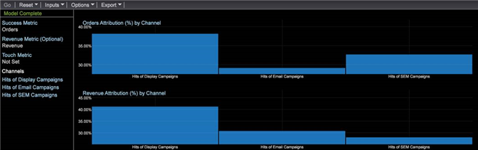

# Attribut för bästa passform{#best-fit-attribution}

{{eol}}

Best Fit Attribution är en maskininlärningsmetod för att tilldela attribueringsvärden i olika kanaler för en lyckad konverteringshändelse. Data Workbench utvärderar automatiskt bidragen till framgång i ett tidsfönster per kanal och bygger sedan en attribueringsmodell som bygger på kundernas faktiska interaktionsmönster.

**[!UICONTROL Best Fit Attribution]** gör att du kan jämföra interaktioner, eller kontaktytor, som har bidragit till en framgångsrik försäljning, e-postregistrering eller andra resultatindikatorer. attribueringsanalysen tilldelar automatiskt vikt till de viktigaste kontakterna och ger en attribueringsmodell per kanal baserat på era data och svarar på era marknadsprotokoll och interna protokoll.

Om en kund till exempel besöker er webbplats genom en organisk sökning engagerar han sig sedan med en kampanj och registrerar sig för ett e-postmeddelande, [regelbaserad attribuering](/help/home/c-get-started/c-attribution-profiles/c-rules-attrib/c-rules-attrib.md) identifierar den första beröringen eller sista beröringen, eller distribuerar attribuering jämnt över alla beröringspunkter med förinställda attribueringsmodeller. Om regelbaserad attribuering definieras av användaren anger attributen Bästa passning värden via en algoritm genom att beräkna sannolikheten för en konvertering som en funktion av de observerade beröringspunkterna.

>[!NOTE]
>
>Att köra **Attribut för bästa passform** i Data Workbench måste du uppdatera servercertifikatet ( [!DNL .pem file]) för att stödja Adobe Analytics Premium. Du måste också lägga till **Premium** till din egen [!DNL Profile.cfg] för klienten och få nya certifikat från Adobe ClientCare för Server och Report Server.

## Grundläggande inställningar {#section-db597eaee462412ea7280d1426366c61}

Se [Bygg en Best Fit Attribution](../../../../home/c-get-started/c-attribution-profiles/c-attrib-algorithmic/c-attrib-building.md#concept-fede6fc4f592475fa8b351b1765a522d) för steg-för-steg-instruktioner.

**Ange framgångsmått**
Definiera ett mätvärde som representerar en lyckad händelse.

Resultatmåttet är ofta *Beställningar*&#x200B;även om du kan använda Data Workbench för att definiera ett mycket komplicerat framgångsmått i samband med fönstret Slutfört.

**Ange pekskärmsmått** (valfritt)

Identifiera interaktioner för att spåra det som ledde till en lyckad konvertering och ange sedan det Touch-mått över vilket attribueringen ska beräknas.

>[!NOTE]
>
>Du behöver bara ange ett Touch-mått om du använder det för att härleda kanalmått från dra-och-släpp-element i stället för att använda befintliga kanalmått.

Om du inte har definierat något mätvärde för kampanjer eller kanaler, men har dimensioner som representerar kanaler, kan Best Fit Attribution skapa dem automatiskt baserat på Touch-måttet.

Med Touch Metric inställd som *Träffar* och fick en dimension som kallas *Medietyp* med element som innehåller *E-post*, *Pressmeddelande*, *Skriv ut annons* och *Sociala medier* genererar visualiseringen kanalmått för formuläret [!DNL Hits where Media Type = Email] när du drar och släpper elementen till visualiseringen.

Touchmätaren bestämmer sedan allokeringen av attribueringspoäng för att identifiera marknadsföringsinteraktioner som anses vara inflytelserika för framgång, så att ni kan kvalificera marknadsföringsåtgärder för populationen som identifieras i fönstret Framgång. Du kan ange mått som *Sidvyer* eller *Träffar* eller använda anpassade touch-mätvärden som är specifika för dina behov.

I många fall bör pekfönstret innehålla fönstret Slutfört för att utvärdera en lång ledtid i säljcykeln.

**Ange intäktsmått.**

Ni kan välja att identifiera intäkter mellan olika kontaktytor genom att ställa in ett lämpligt intäktsmått. Om det anges visar modellen intäktsfördelningen över indatakanalerna. 

Du kan ställa in ett intäktsmått med valutadatatyper för att tilldela framgång för alla toppkontaktytor som definieras och analyseras. Det här måttet delar upp den slutliga försäljningsintäkten och allokerar baserat på viktningen som tilldelats av algoritmen.

**Ange fönstret Success and Touch.**

Fönstret Slutfört definierar den population som ska undersökas och den period under vilken lyckade händelser inträffar, vilket gör att du kan ange fönster för tid och bredd för populationen som ska användas för analysen genom ett val av arbetsyta. The **Lyckades** fönstret definierar den period och population som ska undersökas för lyckade händelser. The **Touch** window anger den historiska tidsperioden som ska undersökas för kanalinteraktioner som leder fram till lyckade händelser.

>[!NOTE]
>
>Du behöver bara ange ett Touch-mått om du försöker att automatiskt skapa Success-mått genom att dra dimensionselement till visualiseringen.

Du kan ange en dag, en månad, ett år eller en tillgänglig tidsram för att begränsa utvärderingen av lyckade händelser och pekhändelser under hela säljcykeln eller för specifika målgrupper som kommer in på webbplatsen. Genom att skapa fönster för att begränsa attribuering kan ni fokusera analysen på relevanta tidsperioder för era specifika behov.

I många fall vill du att Touch-fönstret ska innehålla fönstret Success så att du kan utöka analysen över en lång ledtid baserat på försäljningsfönstret. Eller så kan du spåra och analysera kontakterna separat från händelsen success.

**Välj Kanaler.**

När du anger kanaler har du två alternativ.

**Lägg till Touch Metric och lägg till Dimension Elements i kanalerna**

I många fall vill du dela upp de övre kontaktpunkterna efter dimensionselement för att definiera specifika kanaler. Baserat på elementvärdena väljer Best Fit Attribution automatiskt de översta prestandorna och rangordnar dem enligt procentvärden och visar dem i en diagramvisualisering.

En attribueringsmodell byggs genom att de besökare som interagerade under ditt Success-fönster och de kanalpekningar som utfördes eller inte resulterade i en lyckad händelse undersöks under Touch-fönstret.

## Dela upp efter kanaler {#section-a30592b84bc84f57bd2b988824e852d4}

När du anger kanaler finns det två alternativ:

* Lägg till en **Touchmått** och lägg sedan till **Dimension Elements** för kanalerna.

   **eller**

* Skapa mätvärden som filtrerar efter de kanalelement som du vill utvärdera.

**Alternativ 1: Lägg till ett Touch-mått och lägg till Dimension-element för kanaler**.

Det här är det enklare sättet. Med Best Fit Attribution skapas mätvärden automatiskt för utvärdering av attribuering. I exemplet nedan är Touch Metric ***Träffar*** och kanalerna är: ***Visa kampanjer***, ***E-postkampanjer*** och ***SEM-kampanjer***.

Med den här metoden skapar Best Fit Attribution ett mått i bakgrunden för utvärdering av attribueringen i alla kanaler (men du ser aldrig det automatiskt genererade måttet och de sparas inte). I exemplet nedan skapas tre mätvärden där Hits filtreras för var och en av de tre kanalerna (t.ex. *Visa kampanjer*, *E-postkampanjer* och *SEM-kampanjer*). Det här är enklast eftersom du låter Best Fit Attribution skapa mätvärden åt dig.

**Alternativ 2: Skapa ett mått**.

I det andra alternativet skapar och sparar du mätvärden för de kanaler som du vill utvärdera genom att filtrera en viss kanal. Ett exempel på ett sådant mått visas nedan.

I stället för att ange Touch Metric och Dimension Elements för kanalerna kan du sedan klicka på menyraden i visualiseringen och välja **Indata** > **Lägg till kanal** och välj sedan de mätvärden som du har skapat.

Se exemplet på den andra metoden nedan. Resultaten av båda alternativen är identiska.
