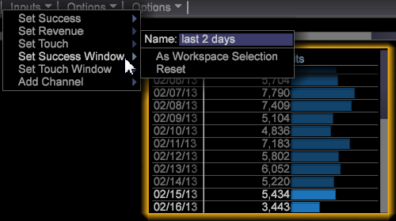

# Skapa en modell för bästa passform{#build-a-best-fit-attribution-model}

Öppna Best Fit Attribution från Premium-menyn och följ de här stegen för att skapa en Best Fit Attribution-modell.

Se en översikt över [Best Fit Attribution](../../../../home/c-get-started/c-attribution-profiles/c-attrib-algorithmic/c-attrib-algorithmic.md#concept-237feb6e9c4d49efaf75399297dcb9d1).

1. Öppna **Attribution för bästa passform**.

   Öppna en arbetsyta och klicka på **[!UICONTROL Premium]** > **[!UICONTROL Best Fit Attribution]**.

   

   >[!NOTE]
   >
   >Best Fit Attribution är en Adobe Analytics Premium-funktion som kräver att du aktiverar Premium i din profil. Du måste uppdatera certifikatet och lägga till Premium-profilen i filen profile.cfg. Se [DWB Server upgrade: 6.2 till 6.3](https://experienceleague.adobe.com/docs/data-workbench/using/install/upgrade-dwb/c-6-2-to-6-3-upgrade.html) för DWB 6.3.

1. Ange **[!UICONTROL Success]**-måttet.

   >[!NOTE]
   >
   >Du kan antingen dra ett mätvärde från en **[!UICONTROL Finder]**-tabell till den vänstra rutan i attribueringsvisualiseringen, eller välja från menyn **Indata**.

   Klicka på **[!UICONTROL Inputs]** > **[!UICONTROL Set Success]**. Måttmenyn öppnas. 

   Välj ett mätvärde som identifierar en lyckad konvertering.

1. (valfritt) Ange **Intäkter**-måttet.

   Ange ett mätvärde för att utvärdera intäkterna under konverteringsprocessen.

1. Ange **touchmåttet**.

   >[!NOTE]
   >
   >Du behöver bara ange ett Touch-mått om du försöker att automatiskt skapa Success-mått genom att dra dimensionselement till visualiseringen.

   Klicka på menyn **[!UICONTROL Inputs]** och välj **Ange beröring** eller dra ett mått från Finder. 

   Detta används för att härleda kanalmått när dimensionselement används som indata.

1. Ange ett **fönster** lyckades.

   Klicka på [!DNL Inputs > Success Window]. Välj ett datumintervall från en tabell och ge sedan fönstret Slutfört ett namn. Klicka på **[!UICONTROL Workspace Selection]** så tilldelas de markerade datumen som tidsintervall för mätningen Slutfört.

   

   >[!NOTE]
   >
   >Eftersom fönstret Success är ett val av arbetsstation kan du inkludera alla dimensioner i fönstret Success.

1. Ange **[!UICONTROL Touch Window]**.

   Klicka på [!DNL Inputs > Touch Window]. Välj ett datumintervall från en tabell och ge sedan pekfönstret ett namn. Klicka på **[!UICONTROL Workspace Selection]** så tilldelas de markerade datumen som tidsintervall för mätningen Slutfört.

   

   Som standard ställs fönstret **Touch** in på samma tidsperiod som fönstret **[!UICONTROL Success]**.

1. (valfritt) Ange ett utbildningsfilter.

   Du kan också ange ett **utbildningsfilter** på arbetsytan för att filtrera besöksdata.

   >[!NOTE]
   >
   >När du ställer in både fönstren Slutfört och Touch kan du använda utbildningsfiltret på de aktuella arbetsytevalen för att ytterligare begränsa dina data.

   

   >[!NOTE]
   >
   >Utbildningsmaterialet hämtas alltid från besökare som uppfyller fönstret Success. Genom att filtrera med filterredigeraren kan du skapa en delmängd av besökarna som rapporteras i fönstret Slutfört.

1. Ange kanalmått som representerar beröringar.

   Dra mätvärden till visualiseringen eller välj dem på menyn [!DNL Inputs] > [!DNL Add Channel]. Om ni inte redan har definierade mätvärden för kampanjer eller kanaler, men har dimensioner som representerar kanaler, kan visualiseringen skapa dem automatiskt med hjälp av en specifikation av ett Touch-mått.

   Med Touch-måttet inställt på [!DNL Hits] och givet ett [!DNL dimension] som heter [!DNL Media Type] med element som innehåller exempelvis [!DNL Email], [!DNL Press Release], [!DNL Print Ad] och [!DNL Social Media], genererar visualiseringen kanalmått i formatet [!DNL Hits where Media Type = Email] när du drar och släpper elementen till visualiseringen.

1. Tryck på **Gå**.

   Analysprocessen för bästa passform körs och ett diagram visar attribut per kanal baserat på valda indata.

   >[!NOTE]
   >
   >Högerklicka på **Model Complete** på den färdiga analysen för att se statistik för attribueringsmodellen.

   

När diagrammet är klart visas en attribueringsmodell som beräknas per kanal och en fördelning av *intäkten*-måttet (om det har angetts). Modellen kan sparas internt eller exporteras till andra system.

>[!NOTE]
>
>**[!UICONTROL Streaming]**,  **[!UICONTROL Online]** och  **[!UICONTROL Offline]** lägen ger olika effekter när du skapar en attribueringsmodell som baseras på fördröjningen för de data som utvärderas. I direktuppspelningsläge visas detaljmeddelandet **[!UICONTROL Model Complete]**. I online- och offlinelägen visas informationen **[!UICONTROL Local Model Complete]**.

## Alternativ-menyn {#section-22288867f6c8483a8a38410f4b948346}

Menyn **Alternativ** innehåller avancerade funktioner för att ställa in och visa analysen för bästa passform.

<table id="table_8F6F517B7DBF4259814BEC6D07A72EAC"> 
 <thead> 
  <tr> 
   <th colname="col1" class="entry"> Alternativ-menyn </th> 
   <th colname="col2" class="entry"> Beskrivning </th> 
  </tr>
 </thead>
 <tbody> 
  <tr> 
   <td colname="col1"> Ange utbildningsfilter   </td> 
   <td colname="col2"> Utbildningsfiltret används med fönstret Slutfört för att filtrera populationen när attribueringsmodellen skapas. Detta ger en delmängd av data som bara innehåller de besökare som du vill analysera. 
Obs! Erfarna användare kan också utnyttja flexibiliteten i filter för att fokusera bortom tidslinjen i Success och Touch Windows. Förutom att välja ett tidsintervall kan du välja en uppsättning <i>Refererande domäner</i> om du bara vill undersöka attributet för användare från dessa domäner. 
 </td> 
  </tr> 
  <tr> 
   <td colname="col1"> Visa beskrivning av komplext filter   </td> 
   <td colname="col2"> Visar filterkoden för utbildningsfiltret, fönstret Slutfört och pekfönstret. </td> 
  </tr> 
  <tr> 
   <td colname="col1"> Spara modell   </td> 
   <td colname="col2"> Sparar den aktuella attribueringsmodellen för framtida bruk. </td> 
  </tr> 
  <tr> 
   <td colname="col1"> Läs in modell   </td> 
   <td colname="col2"> Öppnar en tidigare sparad attribueringsmodell. </td> 
  </tr> 
  <tr> 
   <td colname="col1"> Presentationsvy   </td> 
   <td colname="col2"> Döljer den översta menyraden för presentation. </td> 
  </tr> 
  <tr> 
   <td colname="col1"> 
<b>Alternativ &gt; </b> Avancerat innehåller funktioner för att ställa in storleken på kursuppsättningen och ange vilken metod som ska användas vid klassobalans. 
 </td> 
   <td colname="col2"> </td> 
  </tr> 
  <tr> 
   <td colname="col1"> Avancerat &gt; Utbildningsstorlek   </td> 
   <td colname="col2"> 
Anger utbildningens uppsättningsstorlek. 
 
Obs!  Standardstorleken för utbildning är Stor för 250 000 besökare. 
 
    <ul id="ul_5F17C60227C34A85A2C476A32F2B5DCD"> 
     <li id="li_A076FC2AD0214ADDBFCFD82AEA5F0880">Liten = 50 000 </li> 
     <li id="li_17E77E01D5374068BEBC80B3AD4CCD41">Liten = 75 000 </li> 
     <li id="li_7F6B4834742A4BFCBC3DB214425B88C3">Normal = 100 000 </li> 
     <li id="li_0BB7F791603745028CFC661EBC94D8B4">Stor = 250,00 </li> 
     <li id="li_34B60233C84F48F1BCB8040C5195411A">Mycket stor = 500 000 </li> 
    </ul> </td> 
  </tr> 
  <tr> 
   <td colname="col1"><b>Avancerat &gt; Klasssaldo  </b> </td> 
   <td colname="col2"> 
Identifierar och definierar antalet indataposter som ska genereras för ett klassproblem baserat på datamängdens storlek. 
 </td> 
  </tr> 
 </tbody> 
</table>

| Alternativ för att återställa och ta bort | Beskrivning |
|---|---|
| **[!UICONTROL Reset Model]** | På **[!UICONTROL Reset]**-menyn väljer du **[!UICONTROL Reset Model]** för att rensa visualiseringen men behålla indatavärden. |
| **[!UICONTROL Reset All]** | På menyn **[!UICONTROL Reset]** väljer du **[!UICONTROL Reset All]** för att rensa visualisering och indatamätningar. |
| **[!UICONTROL Remove]** | Högerklicka på en inmatning och välj **[!UICONTROL Remove]** för att rensa måttet från den valda inmatningen. |
| **[!UICONTROL Remove All]** | Högerklicka på *Kanaler* och välj **[!UICONTROL Remove All]** om du vill ta bort alla indatavärden. |
