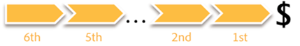

# Attributionsmodeller{#attribution-models}

Det finns sju olika attribueringsmodeller som kan användas tillsammans med attribueringsprofilen för att illustrera och kvantifiera kundens marknadsföringsresa.

**Första och sista** **modellen**

De första attribueringsmodellerna är de traditionella **första** och **sista** kontakterna. Genom att förstå det första steget till att konvertera en försäljning eller den sista kontakten innan du checkar ut och köper en produkt får du en förståelse för kampanjtyper - för medvetenhet, den första kontakten och för att ringa till åtgärd, den sista kontakten.

**Jämn** **modell**

Utsikten i marknadsföringsengagemanget byggs ut i och med introduktionen av **Even**. Varje godkänd interaktion med marknadsföring får samma andel av påföljande order och intäkter som genereras av konverteringen.

**Starter, Player och Closer** **model**

Och förutom en jämn fördelning erbjuder **Starter-, Player- och Closer** -modellen ett positionsbaserat viktningsschema med justerbar vikt. Vikten kan undersökas vid analys.

Titta på följande exempel: Startsidan (eller den första) får 30 procent av de konverterade intäkterna, närmare (eller sista) får 30 procent och alla spelare (de mellanliggande) delar en lika stor del av de återstående 40 procenten.

>[!NOTE]
>
>Det är ganska vanligt att tilldela tilldelningen tillbaka till marknadsföringsinteraktioner baserat på antingen intäkter eller förekomst av ordern. Dessa två nästa modeller tilldelar olika egenskaper till marknadsföringsinteraktionerna för att visa på andra dynamik i framgången.

**Angränsande modell**

Angränsningsmodellen ger synlighet i marknadsföringspositionen bort från konverteringen och besvarar frågan: Är marknadsföringskanalen vanligtvis den 1`st` (närmaste), 5`th`eller 10`th` marknadsföringskanalen ifrån framgång?

**Latensmodell**

Modellen **Latens** beskriver fördröjningen mellan interaktionen med marknadsföringskanalen och förekomsten av framgång. Detta är användbart för att presentera kampanjer av typen medvetenhet eller typ av uppmaning till handling och veta vilken nytta företaget kan dra av för att få en mer snabb reaktion från en målgrupp. (Värdet noll (0) dagar innebär att marknadsföringsinteraktionen inträffade samma dag som framgången.)

**Målningsmodell**

Pathing-modellen erbjuder olika metoder för att utforska kundens engagemang i marknadsföring och hans eller hennes lyckade konvertering, vilket etablerar relationen mellan marknadsföringsinteraktioner under kundresan. Utforska processkartorna för att förstå flöden på hög nivå mellan stöd för marknadsföringskanaler och framgång. Utvärdera direkta sekventiella marknadsföringsinteraktioner med sökvägsläsaren.

Visualisering i sökvägsläsaren

**Visualisering av 2D-processmappning**

**Visualisering av 3D-processmappning**

