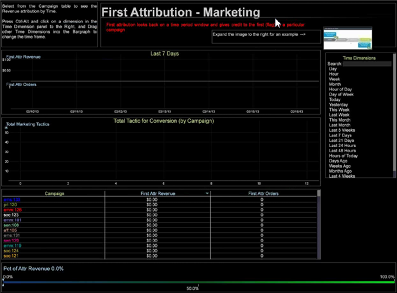

# Attributionsprofil{#attribution-profile}

{{eol}}

Med den nya regelbaserade attribueringsprofilen i Data Workbench kan du snabbt analysera attribueringshändelser och tilldela ansvar som leder till en lyckad konvertering som du har definierat. Attributprofilen innehåller den information som behövs för att din dataarkitekt ska kunna ställa in och utöka sina funktioner, och innehåller färdiga arbetsytor som din analytiker kan använda för att komma igång direkt.

Med attribueringsprofilen kan ni få ett nytt perspektiv på relationen mellan era marknadsföringssatsningar och en framgångsrik generering av kundleads eller försäljningskonvertering. Attribution profile (Attribution profile) hjälper er att kvalificera interaktioner som ska få kredit för realiserade intäkter eller deltagande längre fram i kundresan. Det hjälper er att identifiera effekten av era marknadsföringssatsningar och kostnader genom att ni snabbt kan analysera attribueringshändelser och sedan tilldela ansvar för första eller sista kontakten eller andra händelser som leder till en framgångsrik försäljning.

<!--  -->

>[!IMPORTANT]
>
>Attributprofilen är konfigurerad för omedelbar användning av användare som har implementerat den Adobe SC-profil som använder dataflödet för analys (SC/Insight). Som standard används händelserna Marketing och Conversion som standardtyper av interaktioner som utvärderas i de regelbaserade modellerna.

Se [Distribuera attributprofilen](../../../../home/c-get-started/c-attribution-profiles/c-rules-attrib/c-attrib-profile-deploy.md#concept-fbcb5800cd6a40cc901e61f3882988c0) och [Attributionsmodeller](../../../../home/c-get-started/c-attribution-profiles/c-rules-attrib/c-attrib-models.md#concept-e209c7e86a5c4008ad6d78fdf4ea032d) för ytterligare information.

## Arkitektur- och analytikerarbetsytor {#section-27c6aff70ba147cca6e11451e127afb4}

I attribueringsprofilen har du definierat arbetsytorna Architect och Analyst på olika flikar i workbench.

**Arkitekturarbetsytor**

I **Attribut** klickar du på **[!UICONTROL Architect Workspace]** för att öppna arbetsytor som är särskilt utformade för att konfigurera konfigurationsfiler för grundläggande attribueringsmodellering.

Fliken Arkitektur innehåller arbetsytor som du kan använda för att stega igenom varje konfigurationsfil i mappen för profildatamängder. Till exempel: **[!UICONTROL Attribution Configuration - Step 1]** gör att du kan identifiera attributvärden i avsnittet Omvandling i [!DNL profile.cfg] -fil.

**Arbetsytor för analytiker** Klicka på **[!UICONTROL Analyst]** **[!UICONTROL Workspaces]** för att öppna arbetsytor med färdiga analyser som använder de dimensioner och mått som ingår i attributprofilen.

De här arbetsytorna är ordnade i fyra kategorier:

1. **Grundläggande rapporter** visa en modell i en arbetsyta.
1. **Komparativa rapporter** har utvidgat analyserna genom att presentera flera modeller i en enda vy.
1. **Utredningsrapporter** utökar rapportmallarna så att attribueringsmodellerna visas i olika format. I det här avsnittet introduceras och exponeras också de positionsbaserade viktningsförhållandena.
1. **Sökrapporter** ge insyn i kundens marknadsföringsresa med olika målningsvisualiseringar för att fullt ut utforska och uttrycka processflöden och interaktionsvägar

Fliken Analytiker innehåller arbetsytor som är förkonfigurerade med rapporter. Till exempel: **[!UICONTROL First Attribution]** gör att du kan välja bland **[!UICONTROL Campaign]** tabellen för att se **[!UICONTROL Revenue]** attribuering baserad på **[!UICONTROL Time]**.

