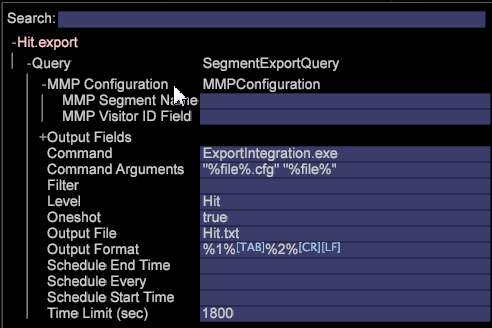

# Export av överordnad marknadsföringsprofil{#master-marketing-profile-export}

{{eol}}

Med Data Workbench kan du exportera filer för integrering med profiler och målgrupper som en del av en integrerad Adobe Experience Cloud.

<!-- <a id="section_731922BC8628479198A41EF3EA72F2FF"></a> -->

Profiler och målgrupper ingår i [Experience Cloud Identity Service](https://experienceleague.adobe.com/docs/id-service/using/home.html), en kärntjänst i [!DNL Adobe Experience Cloud]. Exporten av profiler och målgrupper gör det möjligt att dela målgrupper över hela Experience Cloud med hjälp av ett unikt Experience Cloud-ID (ECID) som tilldelas varje besökare och sedan används av [Audience Manager](https://experienceleague.adobe.com/docs/audience-manager/user-guide/aam-home.html). The [!DNL ExportIntegration.exe] program ( [!DNL E:\Server\Scripts]) används för att generera både MMP- och Adobe Target-exporter.

**Konfigurera FSU-servern för användning av profiler och målgrupper**

1. Åtkomst till din FSU-server.
1. Öppna filen MPExport.cfg. `Server/Admin/Export/MMPExport.cfg`.
1. Ange önskade värden i alla fält. Exempel:

   >[!NOTE]
   >
   >MMP/AAM-integrering bygger på Amazon s3-bucket för dataöverföring.
   >
   >
   >S3-informationen som krävs för MMP-överföring (s3) kan hämtas från Audience Manager team.

   ```
   Sample MMPExport.cfg
   MMP Export Configuration = MMPExportConfiguration: 
   s3 Bucket = string: aws_bucket_for_mmp 
   s3 Object Directory = string: test/files/ 
   s3 Region = string: us-east-1 
   s3 Access Key = string: ZZKI62OO5YBA 
   s3 Secret Key = string: ioqwa3OpNE5 
   data Provider Name = string: 895 
   client ID = string: mcprofile2-test 
   client Secret = string: saea1287617212987q 
   username = string: mmptest 
   password = string: pass 
   numRecordsPerChunk = int:  
   numThreads = int:  
   maxRetriesOnSendFailure = unsigned int:
   ```

   >[!NOTE]
   >
   >The [!DNL MMPExport.cfg]kan du också ta med alla poster, dela upp dem i uppsättningar och skapa grupper med poster. Posterna exporteras sedan till Amazon S3. Tre obligatoriska parametrar krävs för att skapa grupper av poster: [!DNL numRecordsPerChunk], [!DNL numThreads]och [!DNL maxRetriesOnSendFailure].

**Definition av parametrar**

<table id="table_DDEFBC45895A4663973F9C2EB9052FEF"> 
 <thead> 
  <tr> 
   <th colname="col1" class="entry"> Parameter </th> 
   <th colname="col2" class="entry"> Definition </th> 
  </tr> 
 </thead>
 <tbody> 
  <tr> 
   <td colname="col1"> <i>s3 Bucket</i> </td> 
   <td colname="col2"> Den AWS S3-bucket dit exporten överförs. </td> 
  </tr> 
  <tr> 
   <td colname="col1"> <i>s3 Object Directory</i> </td> 
   <td colname="col2"> En sökväg där s3-filer sparas. Detta stöder underkataloger. <p> <p>Viktigt: Blanksteg och flerbytetecken tillåts inte i sökvägen och kommer att skapa fel i exporten. (Intensiteten är tillåten). </p> </p> </td> 
  </tr> 
  <tr> 
   <td colname="col1"> <i>s3-region</i> </td> 
   <td colname="col2"> Den AWS s3-region dit exporten skickas. Exempel. us-east-1 </td> 
  </tr> 
  <tr> 
   <td colname="col1"> <i>s3-åtkomstnyckel</i> </td> 
   <td colname="col2"> AWS s3 Access Key </td> 
  </tr> 
  <tr> 
   <td colname="col1"> <i>s3 hemlig nyckel</i> </td> 
   <td colname="col2"> AWS s3 Secret Key </td> 
  </tr> 
  <tr> 
   <td colname="col1"> <i>dataproviderns namn</i> </td> 
   <td colname="col2"> Det här är mappnamnet som används för att lagra segment och egenskaper i AAM. Detta bör vara unikt per kund. </td> 
  </tr> 
  <tr> 
   <td colname="col1"> <i>klient-ID</i> </td> 
   <td colname="col2"> Detta är ett unikt klient-ID som tillhandahålls till en kund när det tillhandahålls för MMP. </td> 
  </tr> 
  <tr> 
   <td colname="col1"> <i>klienthemlighet</i> </td> 
   <td colname="col2"> <p><i></i>Detta är en unik klienthemlighet som kunden får när han/hon etableras för MMP. </p> </td> 
  </tr> 
  <tr> 
   <td colname="col1"> <i>användarnamn</i> </td> 
   <td colname="col2"> MMP-användarnamn </td> 
  </tr> 
  <tr> 
   <td colname="col1"> <i>lösenord</i> </td> 
   <td colname="col2"> MMP-lösenord </td> 
  </tr> 
  <tr> 
   <td colname="col1"> <i>numRecordsPerChunk</i> </td> 
   <td colname="col2"> <p>Anger segmentstorleken i antal poster. </p> <p>Implementeringen klipper av det värde som användaren anger till min = 1000 records&amp;nbsp;(~50 kB chunks)&amp;nbsp; och max = 50000 records (~2,5 MB chunks).&amp;nbsp;Standardvärdet 10000 används om användaren inte anger den här konfigurationsegenskapen. </p> </td> 
  </tr> 
  <tr> 
   <td colname="col1"> <i>numThreads</i> </td> 
   <td colname="col2"> <p>Anger parallelliteten för den segmentsändande delen. Det godkänner ett värde mellan 1 och 24 trådar och dess standardvärde är 12 trådar. </p> </td> 
  </tr> 
  <tr> 
   <td colname="col1"> <i>maxRetriesOnSendFailure</i> </td> 
   <td colname="col2"> <p>Fastställer antalet försök som ska göras om segmentsändning misslyckas. Standardvärdet är 0 som anger inga återförsök. </p> <p>Vilointervallet är 2 sekunder mellan försöken. </p> </td> 
  </tr> 
 </tbody> 
</table>

**Genererar MMP-export från klienten**

1. Öppna en arbetsyta i klienten och högerklicka **[!UICONTROL Tools]**> **[!UICONTROL Detail Table]**.
1. Lägg till **Nivå**.
1. Högerklicka på rubriken och välj **Lägg till attribut**.
1. Högerklicka på rubriken och välj **Ny export av Överordnad marknadsföringsprofil**. 
1. Expandera **Fråga**.

   

1. Expandera **MMP-konfiguration**.
1. (obligatoriskt) Ange **MMP-segmentnamn** och **MMP-besökarfält**. Dessa parametrar får inte vara tomma.
1. The **MMP-segmentnamn** ska matcha det segment-ID som definieras i MMP.
1. The **MMP-besökar-ID** är den attributkolumn som definieras i steg 4 och som motsvarar **Besökar-ID**.
1. När du har angett dessa fält kan du spara exporten genom att högerklicka på rubriken för exporten och välja **Spara** som &quot;User\.export&quot;.
1. Öppna **Administratör** > **Profilhanteraren** och spara exporten till profilen.

   Om alla data anges korrekt genereras en exportfil i FSU ([!DNL Server/Exports]) och den kommer också att överföra exporten till AWS med hjälp av informationen i [!DNL MMPExport.cfg]. Loggen för detta finns i [!DNL Server/Trace/]. t.ex., [!DNL MMP-102014-133651- `<Segment Export Name>` .log]

```
Query = SegmentExportQuery: 
Command = string: ExportIntegration.exe 
Command Arguments = string: \"%file%.cfg\" \"%file%\" 
Filter = string: 
Level = string: Page View 
MMP Configuration = MMPConfiguration: 
MMP Segment Name = string: 12345 
MMP Visitor ID Field = string: Tracking ID 
Oneshot = bool: true 
Output Fields = vector: 3 items 
0 = ColumnDefinition: 
Column Name = string: 
Field Name = string: Tracking ID 
1 = ColumnDefinition: 
Column Name = string: 
Field Name = string: PID 
2 = ColumnDefinition: 
Column Name = string: 
Field Name = string: SID 
Output File = string: MMPTest.txt 
Output Format = string: %1%\t%2%\t%3%\r\n 
Schedule End Time = string: 
Schedule Every = string: 
Schedule Start Time = string: 
Time Limit (sec) = double: 1800 
```

| Konfigurationsinformation | Beskrivning |
|---|---|
| MMP-segment-ID | Obligatoriskt. Detta är en identifierare som du definierar först i Audience Manager. |
| MMP-besökarfält | Mappa ECID. |
