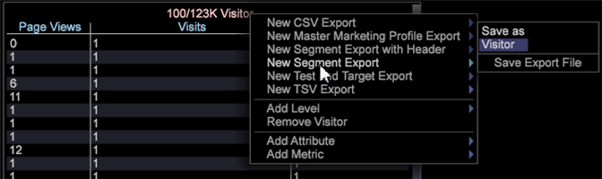

# Segmentexport med anpassade rubriker{#segment-export-with-custom-headers}

Skapa anpassade kolumnexportrubriker för segmentexportfilerna för att enkelt lägga till lättförstådda beskrivningar för exporterade segment. Med den här exportfunktionen kan du också exportera som TSV- och CSV-filer.

Ny funktionalitet har lagts till i segmentexport, inklusive möjligheten att exportera med en rubrik eller i CSV- och TSV-format.

Du kan skapa kolumnrubriker för dina exportfiler.

## Skapa en ny segmentexport {#section-cffff55855f8467ea468b71393ab7676}

1. Öppna en arbetsyta och högerklicka **[!UICONTROL Tools]** > **[!UICONTROL Detail Table]**.

1. Högerklicka och välj **[!UICONTROL Add Level > Extended]** > Välj ett objekt.
1. Högerklicka på titeln och välj **[!UICONTROL Add Attribute.]** Välj en dimension på menyn.

1. Högerklicka på titeln och välj **[!UICONTROL Add Metric.]** Välj ett mätvärde på menyn.

1. Högerklicka på titeln och välj **[!UICONTROL New Segment Export]**.

   

   **[!UICONTROL New Segment Export with Header]** fyller automatiskt i kolumnnamnet med måttets namn. **[!UICONTROL New Segment Export]** kräver att du anger ett anpassat namn. 

   >[!NOTE]
   >
   >Fältet Kolumnnamn får inte vara tomt eller så finns inte rubriken.

1. Högerklicka och namnge segmentet och klicka sedan **[!UICONTROL Save Export File]**.

   Ett exportfönster öppnas.

1. Högerklicka på exportnamnet och klicka på **Spara som`<export filename>`**.

   

1. Högerklicka [!DNL Admin] > [!DNL Profile Manager] > [!DNL Expand Export]. Hitta den exportfil du just skapade och spara den i en befintlig profil.

   

