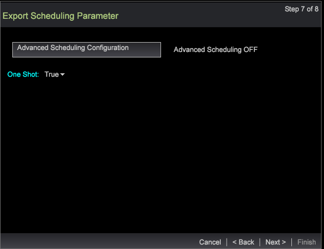

# Guiden för segmentexport{#segment-export-wizard}

Exportera segment med hjälp av guiden för segmentexport

Guiden för segmentexport innehåller en stegvis process för att konfigurera och exportera segment i stället för att [exportera segment från en detaljtabell](https://experienceleague.adobe.com/docs/data-workbench/using/client/export-data/c-sgmt-expt.html).

## Exportera segment med guiden {#section-b30f2699dbc7490bad18512b91cb0cb3}

Om du vill öppna guiden högerklickar du på en arbetsyta och väljer **Admin** > **Guider** > **Guiden för segmentexport**.

>[!NOTE]
>
>Endast de segment som används innan guiden öppnas hämtas. Dessutom kan segmentexporter som skapats från guiden inte visa externa kommandon.

1. Välj de olika överordnade nivåerna för de dimensioner och mått som ska läggas till i exporten.

   Vilka nivåer som visas beror på vilken profil som valts. Du kan välja flera dimensionsnivåer baserat på profilen.

   

1. Klicka på **Nästa**.
1. Markera Dimension och mått för de markerade nivåerna.

   När du t.ex. har valt Sidvy som överordnad nivå kan du välja de underordnade dimensioner och mått som är tillgängliga för export.

1. Klicka på **Nästa**.

   

   

1. Markera exportformatet och ange ett namn för exportfilen.

   

   Typerna CSV, TSV, segmentexport och segmentexport med huvud behöver inte konfigureras ytterligare. Profilerna och målgruppsexporten, den anpassade posttjänsten och Adobe Target Export måste dock konfigureras i steg 3. Se till exempel konfigurationsfälten för profilerna och målgruppsexporten. Konfigurera de här exporttyperna och klicka på **Nästa**.

   

   

   

1. Konfigurera den valda exporttypen.

   Header - Om Header är True ger du fältet **Output File** namnet.

   Escape-fält - Ange som **Sant** eller **Falskt**.

   Fältordning - Välj ett fält och flytta uppåt eller nedåt för att ange ordningen i exportfilen.

   

   Klicka på **Nästa**.

1. Visa Nivå och använda filter i den här dialogrutan. Klicka på **Nästa**. 

1. Om **CSV**, **TSV**, **Segmentexport** eller **Segmentexport med rubrik** är valt finns det tre alternativ:

   Allmän export - Utdatafilen genereras av servern i mappen Server/Export.

   

   FTP-export - Utdatafilen överförs till den valda servern. (Serverns lista hämtas från filen FTPServerInfo.cfg.)

   

   SFTP-export - Utdatafilen överförs säkert till den valda servern.

1. Klicka på **Nästa**

   **Obs!** Om den valda exporttypen är  **Profiler och Audience Export**,  **Custom Record Service** och  **Adobe Target Export**, kommer texten att vara statisk baserat på den markerade exporten.

1. Konfigurera schemaläggningsparametrar.

   **Ett** Shotcan anges till True eller False.

   **Avancerad** schemaläggning kan aktiveras och inaktiveras genom att klicka på knappen Avancerad schemakonfiguration.

   

   Precis som när du exporterar från detaljtabellen försvinner ett foto om den avancerade inställningen är aktiverad. Klicka på **Nästa**.

1. Förhandsgranska exportfilen och klicka sedan på **Kör export**.

   

   

Följande exporttyper är tillgängliga med guiden:

**Segmentexporttyper**

* Allmän
* FTP
* SFTP

**Segmentexport med rubrik**

* Allmän
* FTP
* SFTP

**CSV-export**

* Allmän
* FTP
* SFTP

**TSV-export**

* Allmän
* FTP
* SFTP
