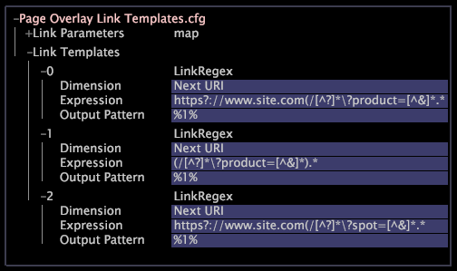

# Konfigurera en sidövertäckning{#configure-a-page-overlay}

Sidövertäckningar konfigureras bara i programmet Plats, men de kan konfigureras för andra program.

Kontakta Adobe Consulting Services om du vill ha information om hur du konfigurerar sidövertäckning för ett annat program.

Visualisering av sidövertäckning är ett verktyg för HTML-länkanalys. När du begär en övertäckning för en viss sida tar Datan Workbench en ögonblicksbild av den faktiska sidan så som den skulle visas i en webbläsare och tolkar HTML-koden som representerar länkar enligt en lista med reguljära uttryck som du definierar. För varje länk på den valda sidan försöker programmet hitta ett mönster för reguljära uttryck genom att arbeta nedåt i listan tills den första matchningen hittas. Om det finns en matchning visas länken markerad i sidövertäckningen.

Sidövertäckningen visar endast data när du lägger till en färgförklaring på arbetsytan som innehåller sidövertäckningen.

>[!NOTE]
>
>För att konfigurera sidövertäckning krävs noggrann konfigurering och det går att skapa missvisande resultat om länkarna inte är korrekt mappade till data. Det arbete som utförs med att konfigurera sidövertäckning för en viss plats beror på hur länkar presenteras i HTML-koden på webbplatsens sidor.

Sidövertäckningen föreslår till sin natur den mentala modellen där användaren klickar. Om de data som ligger till grund för visualiseringen inte överensstämmer med den här modellen är risken för missförstånd hög.

I [!DNL Site] representerar en länk vanligtvis ett element från dimensionen Nästa URI eller Nästa länk, men du kan mappa en länk till en dimension som är lämplig för din analys. Kontakta Adobe Consulting Services om du vill ha information om hur du konfigurerar sidövertäckning för andra dimensioner.

>[!NOTE]
>
>Du bör inte använda siddimensionen för sidövertäckning. Användare kan byta namn på elementen i siddimensionerna och på så sätt ändra länksyntaxen som sidövertäckningsfunktionen är beroende av.

Om du vill konfigurera sidövertäckning för [!DNL Site] måste du redigera två filer:

* **[!DNL Page Overlay.vw]:** Den här filen är en mallfil för att skapa visualiseringar för sidövertäckning. Minst en mallfil måste finnas i den profil som du konfigurerar sidövertäckning för.
* **[!DNL Page Overlay Link Templates.cfg]:** När sidövertäckningsvisualiseringen läser in en sida identifierar den automatiskt länkarna på sidan och deras mål. Om du vill koppla dessa länkar till element i data måste du definiera en uppsättning reguljära uttryck i den här filen.

   Du kan definiera flera reguljära uttryck som matchar elementen i dimensionen. Den ordning i vilken du definierar uttrycken är viktig. När du begär en övertäckning för en viss sida tar Datan Workbench en ögonblicksbild av den faktiska sidan så som den skulle visas i en webbläsare och tolkar HTML-koden som representerar länkar enligt en lista med reguljära uttryck som du definierar. För varje länk på den valda sidan försöker programmet hitta ett mönster för reguljära uttryck genom att arbeta nedåt i listan tills den första matchningen hittas. Det första uttrycket som matchar ett dimensionselement är det som används. Därför är det bäst att först lista det reguljära uttrycket med det mest specifika matchande mönstret, följt av mindre specifika uttryck. Om det finns en matchning visas länken markerad i sidövertäckningsvisualiseringen.

**Konfigurera sidövertäckning för webbplatsen**

1. I

   Gå till **[!UICONTROL Context]** > **[!UICONTROL Dimension Element]** > **[!UICONTROL URI]** i [!DNL Profile Manager].

   >[!NOTE]
   >
   >Katalogen Dimension Element innehåller de snabbmenyalternativ som visas när du högerklickar på ett dimensionselement. Öppna till exempel en URI-tabell och välj sedan ett URI-element. Högerklicka på URI:n så visas sidövertäckning.

1. Högerklicka på bockmarkeringen bredvid filen [!DNL Page Overlay.vw] i URI-mappen och klicka på **[!UICONTROL Make Local]**. En bock för den här filen visas i kolumnen [!DNL User].
1. Högerklicka på den nya bockmarkeringen och klicka på **[!UICONTROL Open]** > **[!UICONTROL in Notepad]**.
1. Ange domän (och webbläsarhöjd om det behövs).

   ```
   window = simpleBorderWindow: 
     client = scrollWindow: 
       client = PageOverlay: 
         URI Template = string: http://%Domain%%Element%
         URI Parameters = map: 
           Domain = string: domain name
           Element = ref: Element/Name
         Dim = ref: wdata/model/dim/URI
         Dim Element = ref: Element/Name
         Level = ref: wdata/model/dim/Page View
         Group = ref: wdata/model/dim/Session
         Browser Height = int: browser height
     pos = v3d: (518, 202, 0)
     size = v3d: (810, 610, 0)
     titleBar = editor: 
       size = v3d: (61, 19, 0)
       text = string: 
   ```

1. Spara filen.
1. Om du vill göra den här ändringen tillgänglig för alla användare av arbetsprofilen högerklickar du i [!DNL Profile Manager] på bockmarkeringen för filen [!DNL .vw] i kolumnen [!DNL User] och klickar på **[!UICONTROL Save to]** > *&lt;**[!UICONTROL working profile name]**>*.

   >[!NOTE]
   >
   >Du kan skapa ytterligare mallfiler för andra platser eller underdomäner. Varje mall som du skapar visas i [!DNL Page Overlay menu].

1. Högerklicka på bockmarkeringen intill [!DNL Page Overlay Link Templates.cfg]-filen i mappen Context i [!DNL Profile Manager] och klicka på **[!UICONTROL Make Local]**.

   En bock för den här filen visas i kolumnen [!DNL User].

1. Högerklicka på den nya bockmarkeringen och klicka på **[!UICONTROL Open]** > **[!UICONTROL from the workbench]**.
1. Högerklicka på **[!UICONTROL Link Templates]** och klicka på **[!UICONTROL Add new]** > **[!UICONTROL Regular Expression]**.
1. Redigera parametrarna för LinkRegex-vektorn efter behov:

<table id="table_24DD4BB5009542F7BB1DA3318E2E6E2B"> 
 <thead> 
  <tr> 
   <th colname="col1" class="entry"> För den här parametern.. </th> 
   <th colname="col2" class="entry"> Ange den här informationen... </th> 
  </tr>
 </thead>
 <tbody> 
  <tr> 
   <td colname="col1"> <p>Dimension </p> </td> 
   <td colname="col2"> <p>Dimensionen (vanligtvis dimensionen Nästa URI) som representeras av länken. </p> </td> 
  </tr> 
  <tr> 
   <td colname="col1"> <p>Uttryck </p> </td> 
   <td colname="col2"> <p>Det reguljära uttryck som används för att markera den relevanta delen av HTML-länken för att hitta nästa element från Dimensionen. Det reguljära uttrycket måste vara en exakt matchning och det önskade utdatamönstret grupperas med parenteser. Mer information om reguljära uttryck finns i <i>Konfigurationshandboken för datauppsättningar</i>. </p> </td> 
  </tr> 
  <tr> 
   <td colname="col1"> <p>Utdatamönster </p> </td> 
   <td colname="col2"> <p>Utdatamönstret för det reguljära uttryck som används för att extrahera det resulterande elementet i Dimension-parametern. </p> </td> 
  </tr> 
 </tbody> 
</table>

I följande exempelfil visas tre reguljära uttryck:



1. Om du vill spara filen högerklickar du på **[!UICONTROL (modified)]** längst upp i fönstret och klickar på **[!UICONTROL Save]**.
1. Om du vill göra den här ändringen tillgänglig för alla användare av arbetsprofilen högerklickar du på bockmarkeringen för [!DNL Page Overlay Link Templates.cfg] i kolumnen [!DNL User] och klickar på **[!UICONTROL Save to]** > *&lt;**[!UICONTROL working profile name]**>*.
