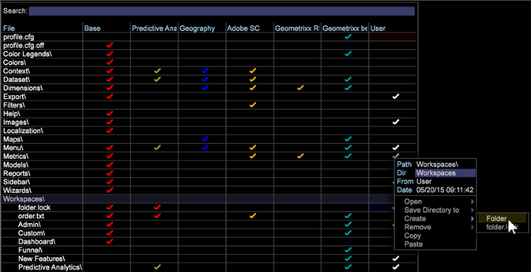
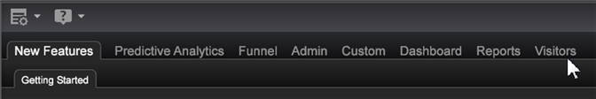

# Lägga till en flik i datorn{#add-a-tab-to-the-worktop}

{{eol}}

Lägg till en flik i skrivbordet för att snabbt få åtkomst till en arbetsyta.

Du kan lägga till en arbetsyta som en flik i arbetsytan. Du kan till exempel lägga till en **Besökare** för snabb åtkomst till en översikt över trafiken.

**Lägga till en mapp i Profilhanteraren**

1. Öppna arbetsytan som du vill associera med den nya fliken och högerklicka sedan **Administratör** > **Profilhanteraren**.
1. I [!DNL Profile Manager], klicka **[!UICONTROL Workspaces]** för att visa innehållet.
1. Högerklicka i dialogrutan [!DNL User] kolumn för [!DNL Workspaces] och markera **[!UICONTROL Create]** > **[!UICONTROL Folder]**.

   

   Då skapas en ny undermapp som innehåller de filer som du vill ska vara tillgängliga via den nya fliken. En ny mapp visas med namnet Ny mapp.
1. Om du vill byta namn högerklickar du i dialogrutan [!DNL User] -kolumnen för Ny mapp och skriv ett namn i Dir-parametern.

   

   Mappnamnet visas som en flik på skrivbordet.

   

1. (Valfritt) Om du vill göra ändringarna tillgängliga för alla användare av arbetsprofilen högerklickar du på den vita bockmarkeringen för [!DNL .vw] i [!DNL User] kolumn och klicka **[!UICONTROL Save to]** > *&lt;**[!UICONTROL working profile name]**>*.

   Om du bara vill visa den fullstora versionen av arbetsytan för beskrivning och inte miniatyrbilden av den här arbetsytan, måste du spara arbetsytan i arbetsprofilen. Om du vill göra det går du till [!DNL Profile Manager]högerklickar du på den vita bockmarkeringen för [!DNL description.vw] i [!DNL User] kolumn och klicka sedan på **[!UICONTROL Save to]** > *&lt;**[!UICONTROL working profile name]**>*.
