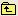

# Konfigurera datauppsättningsschemagränssnittet{#configure-the-dataset-schema-interface}

Steg för att ändra standardvisualiseringen.

Du kan styra vilken typ av visualisering som visas när du klickar på ett dimensionsnamn i en [!DNL Dataset Schema Interface] genom att lägga till filer i profilnamnet*\Context\Dimension Legend folder of the Data Workbench server installation folder. Filen [!DNL Default.1d] i den här mappen styr standardvisualiseringstypen för alla dimensioner. Genom att lägga till en *dimensionsnamn*.1d-fil (till exempel [!DNL Hour.1d]) i den här mappen kan du styra standardvisualiseringen för den aktuella dimensionen.

Mer information om [!DNL Dataset Schema Interfaces] finns i [Dataset Schema Interface](../../../home/c-get-started/c-admin-intrf/c-dtst-sch-intrf.md#concept-e147b3a5b542453ca2b121e1c85bb175).

**Ändra standardvisualisering**

1. I valfri arbetsyta skapar du en visualisering som innehåller de data som du vill ska visas i den nya standardvisualiseringen.

   Om du till exempel vill att dimensionen ska visas i ett stapeldiagram, skapar du en diagramvisualisering som visar det önskade måttet och måttet.

1. Högerklicka på bildtextfönstrets övre kant och klicka på **[!UICONTROL Save]**.
1. I fönstret [!DNL Save] klickar du på , dubbelklickar på **[!UICONTROL Context]** och dubbelklickar sedan på **[!UICONTROL Dimension Legend]**.
1. Skriv dimensionsnamnet i fältet [!DNL File Name].

   Namnet på filen [!DNL .1d] måste matcha namnet på dimensionen exakt. Exempel, [!DNL Hour.1d].

1. Ändra filtillägget till &quot;1d&quot; och klicka på **[!UICONTROL Save]**.

   Filen sparas i användarprofilens namn*\Context\Dimension Legend folder.

   Nästa gång du klickar på den dimensionen i en [!DNL Dataset Schema Interface] visas den visualisering du har angett.

1. (Valfritt) Gör den här ändringen tillgänglig för alla användare av arbetsprofilen:

   1. I [!DNL Profile Manager] klickar du på **[!UICONTROL Context]** och sedan på **[!UICONTROL Dimension Legend]**.

   1. Högerklicka på bockmarkeringen bredvid filnamnet för den nya bildtexten i kolumnen [!DNL User] och klicka på **[!UICONTROL Save to]** > *&lt;**[!UICONTROL working profile name]**>*.
