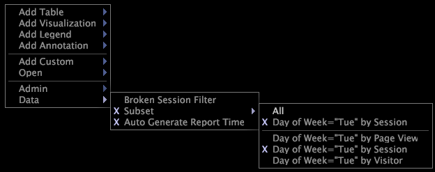

# Ta bort en delmängd{#remove-a-subset}

Steg för att ta bort en datadeluppsättning.

* När du arbetar online högerklickar du på arbetsytan och klickar på **[!UICONTROL Data]** > **[!UICONTROL Subset]** > **[!UICONTROL All]**.

   

