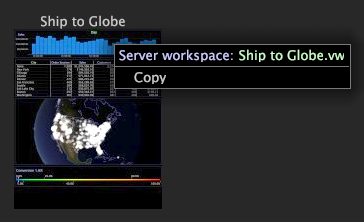

# Skapa en arbetsyta{#create-a-workspace}

Du kan anpassa befintliga arbetsytor genom att lägga till eller ändra befintliga visualiseringar eller skapa nya arbetsytor.

Du kan sedan spara dessa arbetsytor för senare bruk. Se [Skapa arbetsytor](../../../home/c-get-started/c-work-worksp/c-create-worksp.md#concept-d8bc99d7739e4eaeab2a02b022394a31).

Du kan skapa nya arbetsytor genom att skapa en tom arbetsyta, kopiera och klistra in en befintlig arbetsyta, spara en arbetsyta till en annan plats eller använda ett annat namn.

I det här avsnittet beskrivs följande uppgifter:

* [Lägga till nya arbetsytor](../../../home/c-get-started/c-work-worksp/c-create-worksp.md#section-4236ae30e2884ea08f0885bf329f0778)
* [Kopiera och klistra in befintliga arbetsytor](../../../home/c-get-started/c-work-worksp/c-create-worksp.md#section-f91ae89b845640c9a4a52820a6110e65)
* [Ändra ett namn på arbetsytan](../../../home/c-get-started/c-work-worksp/c-create-worksp.md#section-ca7edb913e4e4630a856f45a2536ffad)

## Lägga till nya arbetsytor {#section-4236ae30e2884ea08f0885bf329f0778}

Högerklicka på ett tomt område på fliken [!DNL Worktop] och klicka på något av följande alternativ:

* **[!UICONTROL New]** > **[!UICONTROL Blank Workspace]**. Det här alternativet visar en tom arbetsyta med standardstorlek.

* **[!UICONTROL New]** >  **[!UICONTROL Report Template]**. Det här alternativet visar en mall för standardstorlek som du kan använda för att skapa rapporter.

Miniatyrbilden för den nya typen av arbetsyta visas på fliken.

>[!NOTE]
>
>När du har öppnat en ny arbetsyta kan du behöva klicka på **Lägg till** > **Lås upp** tillfälligt.

## Kopiera och klistra in befintliga arbetsytor {#section-f91ae89b845640c9a4a52820a6110e65}

Du kan kopiera och klistra in en befintlig arbetsyta på en annan arbetsyta. Om du klistrar in arbetsytan på en flik som innehåller en serverversion av en arbetsyta med samma namn klistras arbetsytan in som en lokal version av den arbetsytan. Om du klistrar in arbetsytan på en flik som innehåller server och lokala versioner av en arbetsyta med samma namn klistras arbetsytan in som en användarversion av arbetsytan med samma namn följt av (Kopiera). Om du klistrar in arbetsytan på en flik som inte innehåller en arbetsyta med samma namn klistras arbetsytan in som en ny användararbetsyta.

**Kopiera och klistra in en befintlig arbetsyta**

1. Högerklicka på arbetsytan som du vill kopiera på den önskade fliken [!DNL Worktop] och klicka på **[!UICONTROL Copy]**.

   

1. Gå till fliken där du vill klistra in arbetsytan, högerklicka på ett tomt område på fliken och klicka sedan på **[!UICONTROL Paste]**.

   Följande exempel är en arbetsyta som klistras in på en arbetsyteflik som innehåller en serverversion:

   

Följande exempel är en arbetsyta som klistras in på en arbetsyteflik som redan innehåller en server och en lokal version. Arbetsytan klistras in som en användarversion av den arbetsytan med samma namn följt av (Kopiera):

## Ändra ett namn på arbetsytan {#section-ca7edb913e4e4630a856f45a2536ffad}

**Ändra namnet på en arbetsyta**

1. Klicka på miniatyrbilden för den arbetsyta som du vill visa på den önskade fliken [!DNL Worktop].
1. Klicka på rubriktexten i namnlisten på arbetsytan och skriv den nya titeln, som i följande exempel:

   

## Ta bort en arbetsyta {#section-fb04cc195e1a4a5491ff634f5f3ca972}

**Ändra namnet på en arbetsyta**
