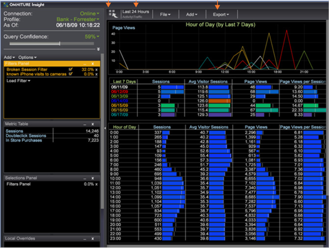

# Visa en arbetsyta{#display-a-workspace}

När du har arbetat med Data Workbench kan du visa en av de många förkonfigurerade arbetsytorna som levereras med Data Workbench.

Sidlisten är en beständig funktion på arbetsytan, om du inte döljer den. Se [Konfigurera sidofältet](../../../home/c-get-started/c-config-sidebar.md#concept-41db771b302e43018e5a9daa40b397e6).

**Visa en befintlig arbetsyta**

Klicka på miniatyrbilden för den arbetsyta som du vill visa på den önskade fliken [!DNL Worktop].

>[!NOTE]
>
>När du har öppnat en ny arbetsyta kan du behöva klicka på **[!UICONTROL Add]** > **[!UICONTROL Temporarily Unlock]**.

Nedan visas ett exempel på en öppen arbetsyta.

**Bläddra i en arbetsyta**

Använd rullningshjulet på musen när du har markören utanför arbetsytan för att bläddra igenom arbetsytan.
