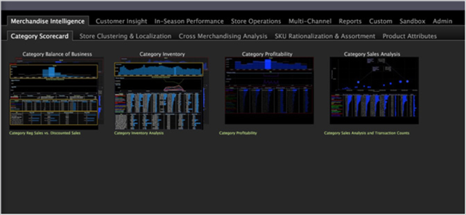

# Visa arbetsytor{#display-workspaces}

En arbetsyta är en behållare för en viss analys- och visualiseringsåtgärd.

En arbetsyta kan innehålla flera visualiseringar, som alla fungerar mot en gemensam uppsättning data (det vill säga, alla visualiseringar på arbetsytan återger samma uppsättning frågeresultat). När du utför en filtreringsåtgärd i en visualisering återspeglas den markerade delmängden i hela arbetsytan.

Nedan visas ett exempel på flera miniatyrbilder av arbetsytan på [!DNL Worktop].

>[!NOTE]
>
>Eftersom implementeringen av Data Workbench kan anpassas helt (det vill säga eftersom flikarna, arbetsytorna och menyalternativen som visas i implementeringen kan skilja sig från vad som beskrivs i den här handboken) är det viktigt att du observerar att du kan visa en lista med alternativ som hör till den arbetsyta eller visualisering som du arbetar i genom att högerklicka nästan var som helst.

Du analyserar dina data genom att kombinera olika typer av visualiseringar i en arbetsyta. Kraftfulla frågor skapas genom att man markerar de data som visas i dessa visualiseringar, vars resultat visas visuellt på arbetsytan i alla visualiseringar. Du använder arbetsytor för att styra omfattningen för varje fråga: Varje markering som görs i en visualisering ändrar den aktuella frågan och påverkar frågorna i andra visualiseringar på arbetsytan. Se [Göra markeringar i visualiseringar](../../../home/c-get-started/c-vis/c-sel-vis/c-sel-vis.md#concept-012870ec22c7476e9afbf3b8b2515746).

>[!NOTE]
>
>När du har öppnat en ny arbetsyta kan du behöva klicka **[!UICONTROL Add]** > **[!UICONTROL Temporarily Unlock]** för att låsa upp skärmen.

