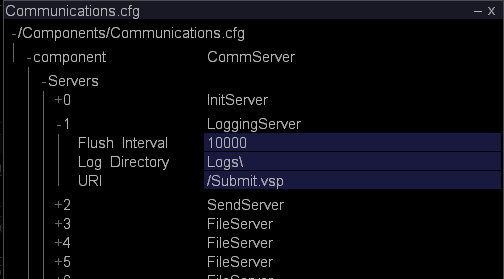

# Övervaka händelsens datautrymme{#monitoring-event-data-space}

Information om övervakning av händelsedataminne och ändring av loggkatalogen för sensordata.

**Rekommenderad frekvens:** var 5-10:e minut

[!DNL Insight Server] lagrar en loggfil per  [!DNL Sensor] dag på databehandlingsenheten eller filserverenheten, beroende på din konfiguration. Storleken på loggfilerna och mängden datalagringsutrymme som krävs för dem beror på många variabler, till exempel antalet webbplatser som loggas och antalet begäranden som webbservrarna tar emot per sekund.

En typisk installation av [!DNL Insight Server] (eller ett [!DNL Insight Server]-kluster) kan lagra flera terabyte data, förutsatt att den maskinvara som rekommenderas av Adobe används för [!DNL Insight Server]-datorerna vid implementeringen.

Vanligtvis finns alla loggdata kvar på [!DNL Insight Server]-datorn. Om det blir nödvändigt att frigöra mer datalagringsutrymme på datorn kan du flytta alla loggfiler utom den senaste dagen till en annan dator eller ett annat datalagringsmedium (zip-enhet, band osv.). Om du flyttar data behöver du inte stoppa [!DNL Insight Server], och det påverkar inte de funktioner som finns i [!DNL Insights] som kan vara anslutna till [!DNL Insight Server] och arbeta med kontinuerliga data. Förutsatt att du inte bearbetar eller bearbetar om en analysdatauppsättning har du fortfarande tillgång till alla tidigare data och nya data är fortfarande tillgängliga i [!DNL Insight]. Om du bearbetar eller bearbetar om en analysdatauppsättning kan du inte komma åt data förrän bearbetningen är klar.

Som standard lagras händelsedata som skapas av [!DNL Sensor] och överförs till [!DNL Insight Server] i mappen [!DNL Logs] i installationskatalogen för [!DNL Insight Server]. Konfigurationsfilen för kommunikation, [!DNL Communications.cfg], anger platsen för händelseloggfiler som läses av [!DNL Insight Server].

**Ändra loggkatalogen för  [!DNL Sensor] data**

1. I [!DNL Insight], på fliken [!DNL Admin] > [!DNL Dataset and Profile], klickar du på miniatyrbilden för **[!UICONTROL Servers Manager]** för att öppna arbetsytan Serverhanteraren.
1. Högerklicka på ikonen för [!DNL Insight Server] som du vill konfigurera och klicka på **[!UICONTROL Server Files]**.
1. Klicka på **[!UICONTROL Components]** i [!DNL Server Files Manager] för att visa innehållet. Filen [!DNL Communications.cfg] finns i den här katalogen.
1. Högerklicka på bockmarkeringen i kolumnen *servernamn* för [!DNL Communications.cfg] och klicka på **[!UICONTROL Make Local]**. En bock visas i kolumnen [!DNL Temp] för [!DNL Communications.cfg].
1. Högerklicka på den nya bockmarkeringen i kolumnen [!DNL Temp] och klicka på **[!UICONTROL Open]** > **[!UICONTROL in Insight]**.
1. I fönstret [!DNL Communications.cfg] klickar du på **[!UICONTROL component]** för att visa innehållet.
1. I fönstret [!DNL Communications.cfg] klickar du på **[!UICONTROL Servers]** för att visa innehållet. Flera typer av servrar kan visas: Filservrar, loggningsservrar, initieringsservrar, statusservrar, skicka-servrar eller replikeringsservrar.
1. Hitta LoggingServer, där [!DNL Sensor] skriver sina loggfiler som ska bearbetas av [!DNL Insight Server], och klicka på dess nummer för att visa menyn.

   

   Standardloggkatalogen är [!DNL Logs]-mappen i installationskatalogen för [!DNL Insight Server].

1. Redigera parametern Loggkatalog så att den återspeglar loggfilernas önskade plats.

   >[!NOTE]
   >
   >Ändra inga andra parametrar för LoggingServer.

   

   Flera FileServers kan listas under servernoden, så du kan behöva visa innehållet i många av dem (genom att klicka på deras nummer i [!DNL Servers]-listan) för att hitta servern med en lokal sökväg till loggar som ska ändras.

1. Redigera den lokala sökvägen för att spegla den önskade platsen för [!DNL .vsl]-filerna.

   >[!NOTE]
   >
   >Ändra inga andra parametrar för FileServer.

   Även om platsen för loggfilerna har ändrats i filen [!DNL Communications.cfg] kan du mappa dessa filer till katalogen Logs i [!DNL Server Files Manager] genom att ange /Logs/ som URI för FileServer.

1. Spara ändringarna på servern genom att göra följande:

   1. Högerklicka på **[!UICONTROL (modified)]** högst upp i fönstret och klicka på **[!UICONTROL Save]**.

   1. I [!DNL Server Files Manager] högerklickar du på bockmarkeringen för filen i kolumnen [!DNL Temp] och väljer **[!UICONTROL Save to]** > *&lt;**[!UICONTROL server name]**>*.
