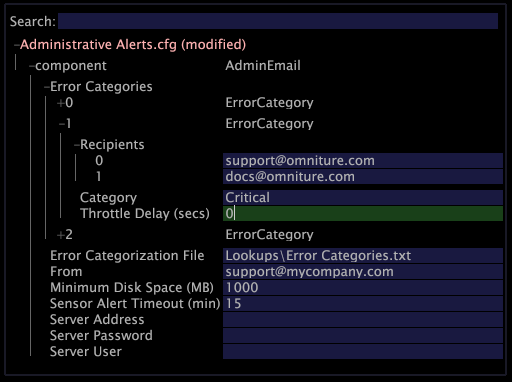

# Konfigurera administrativa aviseringar{#configuring-administrative-alerts}

{{eol}}

Administrativa varningar skickar e-postmeddelanden till de angivna e-postadresserna när fel upptäcks av Insight Server under den normala åtgärden.

**Rekommenderad frekvens:** Före produktion

>[!NOTE]
>
>Användningen av administrativa varningar kräver att [!DNL Insight Server] har åtkomst till en vidarebefordrande SMTP-server för att skicka aviseringar via e-post.

Mottagarna av e-postmeddelanden bör vara nyckelpersoner inom systemadministration och primära intressenter.

filen med administrativa aviseringar, [!DNL Administrative Alerts.cfg]används för att konfigurera administrativa aviseringar för [!DNL Insight Server].

>[!NOTE]
>
>Om du kör ett kluster måste du skapa eller ändra aviseringar på överordnad [!DNL Insight Server] i klustret.

**Skapa eller ändra en administrativ varning**

1. I [!DNL Insight], på [!DNL Admin] > [!DNL Dataset and Profile] klickar du på **[!UICONTROL Servers Manager]** miniatyrbild för att öppna arbetsytan Serverhanteraren.
1. Högerklicka på ikonen för [!DNL Insight Server] du vill konfigurera och klicka på **[!UICONTROL Server Files]**.
1. I [!DNL Server Files Manager], klicka **[!UICONTROL Components]** för att visa innehållet. The [!DNL Administrative Alerts.cfg] filen finns i den här katalogen.
1. Högerklicka på bockmarkeringen i kolumnen *servernamn *för [!DNL Administrative Alerts.cfg] och klicka **[!UICONTROL Make Local]**. En bock visas i [!DNL Temp] kolumn för [!DNL Administrative Alerts.cfg].
1. Högerklicka på den nya bockmarkeringen i dialogrutan [!DNL Temp] kolumn och klicka **[!UICONTROL Open]** > **[!UICONTROL in Insight]**.
1. I [!DNL Administrative Alerts.cfg] fönster, klicka **[!UICONTROL component]** för att visa innehållet.
1. Fyll i parametrarna efter behov. En lista med tillgängliga parametrar i den här filen finns i [Konfigurationsinställningar för administrativa aviseringar](../../../home/c-inst-svr/c-cfg-stgs-ref/c-admin-alts-cfg-stgs.md#concept-14c3c3ed797f47c5900ec04cae2fc491).

   

1. Spara ändringarna på servern genom att göra följande:

   1. Högerklicka **[!UICONTROL (modified)]** längst upp i fönstret och klicka på **[!UICONTROL Save]**.

   1. I [!DNL Server Files Manager]högerklickar du på bockmarkeringen för filen i dialogrutan [!DNL Temp] kolumn och markera **[!UICONTROL Save to]** > *&lt;**[!UICONTROL server name]**>*.

1. (Valfritt) Om du arbetar i ett kluster och vill att samma administrativa varningar ska gälla för varje databehandlingsenhet måste du kopiera och klistra in den uppdaterade [!DNL Administrative Alerts.cfg] till [!DNL Components for Processing Servers] i överordnad [!DNL Insight Server] installationskatalog.
