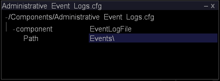

# Övervaka administrativa händelser{#monitoring-administrative-events}

Du bör regelbundet övervaka dina händelseloggfiler för att spåra händelsemeddelanden i Insight Server, som loggas på `<YYYYMMDD>-event.txt` filer som finns som standard i mappen Events i installationskatalogen för Insight Server.

**Rekommenderad frekvens:** Var 5-10:e minut

Du kan övervaka dessa händelser med [!DNL Server Files Manager] in [!DNL Insight], ditt automatiska hanteringsverktyg, [!DNL *-event.txt] eller Windows Event Viewer.

>[!NOTE]
>
>Administrativa händelseloggar är helt skilda från Windows-händelseloggen, men innehåller några av dessa händelser. Loggarna för administrativa händelser innehåller endast information om [!DNL Insight Server] händelser.

**Så här visar du events.txt-filer via[!DNL Server Files Manager]**

1. I [!DNL Insight], på [!DNL Admin] > [!DNL Dataset and Profile] klickar du på **[!UICONTROL Servers Manager]** miniatyrbild för att öppna arbetsytan Serverhanteraren.
1. Högerklicka på ikonen för en aktiv [!DNL Insight Server] och klicka **[!UICONTROL Server Files]**.
1. I [!DNL Server Files Manager], klicka **[!UICONTROL Events]** för att visa innehållet.
1. Högerklicka på bockmarkeringen i dialogrutan *servernamn* kolumn bredvid önskad fil och klicka på **[!UICONTROL Make Local]**. En bock visas bredvid filnamnet i dialogrutan [!DNL Temp] kolumn.
1. Högerklicka på bockmarkeringen i dialogrutan [!DNL Temp] kolumn och klicka **[!UICONTROL Open]** > **[!UICONTROL in Notepad]**. Händelsefilen visas i ett nytt fönster i Microsoft Anteckningar.

   

   The [!DNL Server.log] i [!DNL Trace] i [!DNL Insight Server] installationskatalogen innehåller mer detaljerad loggningsinformation.

**Så här visar du händelser via Windows Event Viewer**

* Klicka på **[!UICONTROL Start]** > **[!UICONTROL Control Panel]** > **[!UICONTROL Administrative Tools]** > **[!UICONTROL Event Viewer]**.

**Så här ändrar du katalogen Administrativa händelseloggar**

Konfigurationsfilen för den administrativa händelseloggen, [!DNL Administrative Events Log.cfg], anger katalogen som händelseloggningen ska skickas till.

1. I [!DNL Insight], på [!DNL Admin] > [!DNL Dataset and Profile] klickar du på **[!UICONTROL Servers Manager]** miniatyrbild för att öppna arbetsytan Serverhanteraren.

1. Högerklicka på ikonen för [!DNL Insight Server] du vill konfigurera och klicka på **[!UICONTROL Server Files]**.

1. I [!DNL Server Files Manager], klicka **[!UICONTROL Components]** för att visa innehållet. The [!DNL Administrative Event Logs.cfg] filen finns i den här katalogen.

1. Högerklicka på bockmarkeringen i dialogrutan *servernamn* kolumn för [!DNL Administrative Event Logs.cfg] och klicka **[!UICONTROL Make Local]**. En bock visas i [!DNL Temp] kolumn för [!DNL Administrative Event Logs.cfg].

1. Högerklicka på den nya bockmarkeringen i dialogrutan [!DNL Temp] kolumn och klicka **[!UICONTROL Open]** > **[!UICONTROL in Insight]**.

1. I [!DNL Administrative Event Logs.cfg] fönster, klicka **[!UICONTROL component]** för att visa innehållet. Standardsökvägen är [!DNL Events] i [!DNL Insight Server] installationskatalog.

   

1. I parametern Path anger du namnet på den katalog som du vill skicka data för händelseloggning till.
1. Spara ändringarna på servern genom att göra följande:

   1. Högerklicka **[!UICONTROL (modified)]** längst upp i fönstret och klicka på **[!UICONTROL Save]**.
   1. I [!DNL Server Files Manager]högerklickar du på bockmarkeringen för filen i dialogrutan [!DNL Temp] kolumn och markera **[!UICONTROL Save to]** > **[!UICONTROL server name]**.
