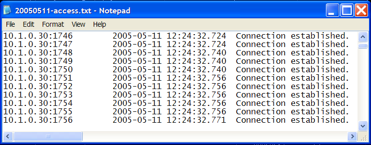

# Övervaka granskningsloggar{#monitoring-audit-logs}

Granskningsloggfiler spårar alla anslutningsförsök till och frånkopplingar från Insight Server, som var och en är loggad i `<YYYYMMDD>-access.txt`-filerna som finns som standard i Granskningsmappen i installationskatalogen för Insight Server.

**Rekommenderad frekvens:** varje dag eller vid behov för felsökning

Granskningsloggar kan vara mycket användbara vid felsökning av problem med anslutning till [!DNL Insight Server]. Du kan övervaka dessa loggar med det automatiska hanteringsverktyget eller genom att visa [!DNL access.txt]-filerna direkt.

**Så här visar du access.txt-filer via[!DNL Server Files Manager]**

1. I [!DNL Insight], på fliken [!DNL Admin] > [!DNL Dataset and Profile], klickar du på miniatyrbilden för **[!UICONTROL Servers Manager]** för att öppna arbetsytan Serverhanteraren.
1. Högerklicka på ikonen för en aktiv [!DNL Insight Server] och klicka på **[!UICONTROL Server Files]**.
1. Klicka på **[!UICONTROL Audit]** i [!DNL Server Files Manager] för att visa innehållet.
1. Högerklicka på bockmarkeringen i kolumnen *servernamn* bredvid önskad fil och klicka på **[!UICONTROL Make Local]**. En bock visas bredvid filnamnet i kolumnen [!DNL Temp].
1. Högerklicka på den nya bockmarkeringen i kolumnen [!DNL Temp] och klicka på **[!UICONTROL Open]** > **[!UICONTROL in Notepad]**. Granskningsloggen visas i ett nytt fönster i Microsoft Windows Anteckningar.

   
