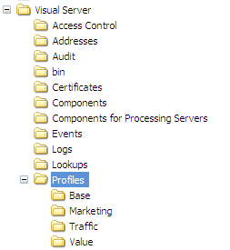

# Installera profiler och sökfiler{#installing-profiles-and-lookup-files}

{{eol}}

De profiler och sökfiler som Adobe har utvecklat för just ditt program är interna profiler som innehåller mått, dimensioner och arbetsytor som gör det möjligt att analysera datauppsättningen.

Precis som med alla andra interna profiler från Adobe bör dessa profiler inte ändras. All anpassning måste ske i datauppsättningen, rollspecifika profiler eller andra profiler som du skapar.

Adobe distribuerar profil- och sökfiler för ditt program som en [!DNL .zip] -fil. Varje zip-fil namnges för det program vars profil och sökningsfiler den innehåller. (Exempel: [!DNL Site52.zip] innehåller profilfilerna för Site v5.2.) The [!DNL .zip] filen innehåller två mappar ( [!DNL Lookups] och [!DNL Profiles]).

>[!NOTE]
>
>Om du inte redan har installationsfilen som innehåller profilerna och sökfilerna för programmet kan du hämta dem från FTP-platsen i Adobe innan du börjar.

Du måste installera profilen och dess sökfiler på [!DNL Insight Server] dator där du bearbetar och kör datauppsättningsprofilen. Om du kör en [!DNL Insight Server] måste du installera filerna på den överordnad servern. Mer information om datauppsättningsprofiler finns i *Konfigurationshandbok för datauppsättning*.

**Så här installerar du profiler för ditt Adobe-program**

1. Öppna [!DNL Profiles] mapp från [!DNL .zip] som du har fått från Adobe.

1. Kopiera alla mappar i mappen [!DNL Profiles] i [!DNL .zip] till [!DNL Profiles] i din [!DNL Insight Server] installationskatalog. Du vill avsluta med [!DNL ...\Profiler\]*&lt; [!DNL internal profile name]>* mappar på [!DNL Insight Server] som i följande exempel. De faktiska profilnamnen kan variera.

   

1. Navigera till  [!DNL Profiles\]*&lt; [!DNL dataset profile name]>* i den katalog där du installerade [!DNL Insight Server] och hitta [!DNL profile.cfg] i den här katalogen.

   >[!NOTE]
   >
   >Om du installerar profiler för första gången kan du använda den medföljande exempelprofilen som datauppsättningsprofil. Du hittar [!DNL profile.cfg] fil (den kan heta något som [!DNL profile.cfg.offline]) för exempelprofilen i [!DNL Profiles\Sample] i din [!DNL Insight Server] installationskatalog.

1. Öppna [!DNL profile.cfg] med en textredigerare som Anteckningar och gör följande:

   1. Lägg till poster för de interna profilerna i katalogvektorn. Profilnamnen motsvarar namnen på katalogerna som du kopierade till [!DNL Profiles] på [!DNL Insight Server] dator.

   1. Uppdatera antalet kataloger efter behov.
   1. Lägg till serverns vanliga namn på raden Gemensamt namn i den här filen, vilket markeras nedan:

      ```
      Profile = profileInfo: 
      Directories = vector: n+1 items
        0 = string: Base\\
        1 = string: internal profile name 1\\
        2 = string: internal profile name 2\\
      . . .
        n = string: internal profile name n\\
      Processing Servers = vector: 1 items
        0 = ProfileServerInfo: 
          Common Name = string: serverCommonName
          Server = string: 
      ```

      >[!NOTE]
      >
      >The *serverCommonName* som du anger för det vanliga namnet i dialogrutan [!DNL profile.cfg] filen motsvarar serverns vanliga namn för [!DNL Insight Server] datorn som du bearbetar och kör datauppsättningsprofilen på. Instruktioner att uppdatera [!DNL profile.cfg] så att datauppsättningsprofilen körs på en [!DNL Insight Server] kluster, se [Insight Server Clusters](../../../../home/c-inst-svr/c-install-ins-svr/c-ins-svr-clstrs/c-abt-ins-svr-clsters.md).

1. Spara filen. Spara filen som [!DNL profile.cfg] om det hade ett annat namn.

**Så här installerar du sökfiler för Adobe-programmet**

1. Öppna [!DNL Lookups] mapp från [!DNL .zip] som du har fått från Adobe.

1. Kopiera alla mappar i mappen [!DNL Lookups] i [!DNL .zip] till [!DNL Lookups] i din [!DNL Insight Server] installationskatalog. Du vill avsluta med [!DNL ...\Lookups\]*&lt; [!DNL internal profile name]>* mappar på [!DNL Insight Server] som i följande exempel. De faktiska profilnamnen kan variera.

   
