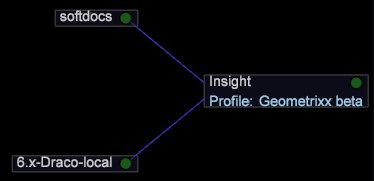

# Konfigurera anslutningen till Insight Server{#configuring-the-connection-to-insight-server}

När du har installerat programmet Insight och det digitala certifikatet måste du starta Insight och konfigurera dess anslutning till Insight Server.

>[!NOTE]
>
>I vissa fall kan anslutningen till Insight Server ha förkonfigurerats av Adobe Consulting Services eller din systemadministratör. I så fall behöver du inte slutföra den här uppgiften.

När du startar Insight för första gången ansluter programmet automatiskt till Adobe License Server för att registrera ditt digitala certifikat. Datorn måste vara ansluten till Internet när du utför följande steg för att registreringsprocessen ska slutföras.

>[!NOTE]
>
>Om du redan har begärt, laddat ned och installerat ett förlåst certifikat enligt beskrivningen i [Hämta och installera det digitala certifikatet](../../../home/c-install-insight/install-setup/c-dgtl-crtf.md#topic-fed3b44e472c4e4ca6dd5852af14cdb9), försöker Insight inte ansluta till licensservern och du får inget fel.

**Konfigurera anslutningen till Insight Server**

När du arbetar i en klustermiljö bör Insight konfigureras för att komma åt master Insight Server för att undvika synkroniseringsproblem. I Insight kan du visa information om bearbetningen [!DNL Insight Servers] i klustret med hjälp av [!DNL Related Servers] menyalternativet i [Serverhanteraren](https://docs.adobe.com/content/help/en/data-workbench/using/client/admin-ui/c-svrs-mgr.html).

1. Starta Insight.
1. Klicka på [!DNL Worktop]på **[!UICONTROL Admin]** och sedan **[!UICONTROL First Steps]**.

1. Klicka på **[!UICONTROL Configure Connection to Servers]** miniatyrbilden.

   Filerna [!DNL Servers Manager], [!DNL Insight.cfg] filen och instruktionerna för hur du konfigurerar [!DNL Insight.cfg]filen visas.

1. Högerklicka i [!DNL Insight.cfg] fönstret **[!UICONTROL Servers]** och klicka **[!UICONTROL Add new child]** > **[!UICONTROL Server]**.

   

1. Fyll i eller ändra serverparametrarna för att ge Insight tillgång till din Master Insight Server. Detaljerade beskrivningar av parametrarna i filen Insight.cfg finns i [Konfigurationsparametrar](https://docs.adobe.com/content/help/en/data-workbench/using/client/c-insght-config-param.html).

   

1. Upprepa steg 4 och steg 5 för varje Insight-server som du vill konfigurera en anslutning till.
1. Om du vill spara konfigurationsändringarna högerklickar du **[!UICONTROL Insight.cfg (modified)]** längst upp i fönstret och klickar på **[!UICONTROL Save as Insight.cfg]**.

   Insight försöker ansluta till [!DNL Insight Server(s)] med de inställningar du har angett. Om en anslutning upprättas visas en grön nod på [!DNL Servers Manager] följande sida.

   

   * **Grön:** Anger att anslutningen till Insight Server är aktiv.
   * **Ljusröd:** Anger ett potentiellt problem med servern, t.ex. att servern har tömts, att mycket minne används eller att det finns för lite diskutrymme.
   * **Röd:** Anger att anslutningen till Insight Server inte är aktiv.
   Om Insight inte kan ansluta med de angivna inställningarna visas en röd nod i [!DNL Servers Manager]. Om detta händer ska du läsa [Felsökning](../../../home/c-install-insight/install-setup/t-conn-trbsh.md#task-034e588c5ce04c4a8f6d0097364d3b2b)av anslutning.

<!--
c_dir_crt_setup.xml
-->

När du väljer en profil som ska användas hämtas profilinformationen (inklusive relaterade data och eventuella arbetsytor eller visualiseringar som definierats för profilen) till datorn. När du hämtar varje profil skapas en mapp med profilnamnet i installationskatalogen.

Om du till exempel väljer en profil med namnet Försäljning visas en mapp med namnet Försäljning i Insight-katalogen. Den här mappen innehåller mått, dimensioner, arbetsytor och visualiseringar som definierats i försäljningsprofilen. Efter den första inläsningen av profilen kan profilen användas när du arbetar offline. Se [Arbeta offline och online](https://docs.adobe.com/content/help/en/data-workbench/using/client/c-off-on.html).

När du ansluter till Insight Server för första gången från Insight skapar Insight Server dessutom följande kataloger i installationskatalogen för Insight.

* **[!DNL Trace]katalog:**I[!DNL Trace]katalogen finns Insight-loggfilen ([!DNL insight.log]). När storleken på[!DNL Insight.log]filen når 100 MB ändras filens namn till[!DNL insight-1.log]. Om det[!DNL insight-1.log]redan finns en fil med det namnet[!DNL insight-1.log]byter namnet till[!DNL insight-2.log], och så vidare, med maximalt[!DNL insight-9.log]. Filen innehåller[!DNL insight.log]alltid den senaste logginformationen och[!DNL insight-max.log]innehåller den äldsta.

* **[!DNL User]katalog:**I[!DNL User]katalogen finns mappar som motsvarar de profiler som används hittills, och i varje profilmapp finns mappar med namnen[!DNL Work]och[!DNL Workspaces]. Katalogen`User\*profile name*\Workspaces`är standardplatsen där Insight-arbetsytefiler sparas.`User\*profile name*\Work`är standardplatsen där visualiseringar av Insight och andra anpassade arbeten som utförs av Insight-användaren sparas.

I följande tabell visas standardplaceringarna för de vanligaste komponenterna.

<table id="table_0254A8C25AF5400F89F87A242746D07E"> 
 <thead> 
  <tr> 
   <th colname="col1" class="entry"> Komponent </th> 
   <th colname="col2" class="entry"> Katalogplats </th> 
  </tr>
 </thead>
 <tbody> 
  <tr> 
   <td colname="col1"> 
Sparade visualiseringar 
 </td> 
   <td colname="col2"> 
<i>Insight</i>\User\<i>profilnamn</i>\Work\ 
 </td> 
  </tr> 
  <tr> 
   <td colname="col1"> 
Sparade  arbetsytor 
 </td> 
   <td colname="col2"> 
<i>Insight</i>\User\<i>profile name</i>\Workspaces\<i>tab name</i>\ 
 </td> 
  </tr> 
  <tr> 
   <td colname="col1"> 
Sparade png -filer 
 </td> 
   <td colname="col2"> 
<i>Insight</i>\User\<i>profilnamn</i>\Work\ 
 </td> 
  </tr> 
  <tr> 
   <td colname="col1"> 
Datacache 
 </td> 
   <td colname="col2"> 
<i>Insight</i>\User\Cache.db 
 </td> 
  </tr> 
  <tr> 
   <td colname="col1"> 
 Insight.log -fil 
 </td> 
   <td colname="col2"> 
<i>Insight</i>\Trace\ 
 </td> 
  </tr> 
 </tbody> 
</table>

<!--
c_config_file_ent.xml
-->

Du kan söka efter nyckelnamn, nyckeltyp eller värde för att snabbt hitta en post och ta bort behovet av att bläddra igenom expanderade stora filer för kapslad information. Du kan hitta dimensionsnamn, servernamn och så vidare. I följande exempel visas matchningar för en sökning på frasemappningen.

Skriv en sökfras i det här fältet för att hitta data. Beroende på om en matchning lyckades ändras fältfärgen. Matchningar visas markerade och icke-matchningar är nedtonade. Om det inte finns några träffar blir bakgrunden i sökfältet röd. När du trycker på Retur expanderar config-trädet varje plats där det finns en matchning och komprimerar där det inte finns någon matchning.

Du kan också använda reguljära uttryck i [!DNL Search] fältet. Du kan till exempel använda följande: [!DNL *zip.*]för alla poster som innehåller ordet &quot;zip&quot;.

Om du vill ta bort en sökning trycker du på **[!UICONTROL Escape]**.
