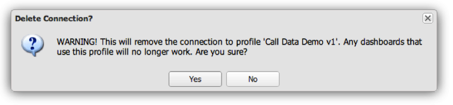

# Ta bort en profilanslutning{#removing-a-profile-connection}

{{eol}}

1. Klicka på **[!UICONTROL X]** i slutet av raden för att ta bort anslutningen till profilen.
1. En fråga om du vill ta bort profilanslutningen visas. Välj **[!UICONTROL Yes]** för att ta bort profilanslutningen.

   

   Om åtgärden lyckades visas ett meddelande om att profilanslutningen har tagits bort.
