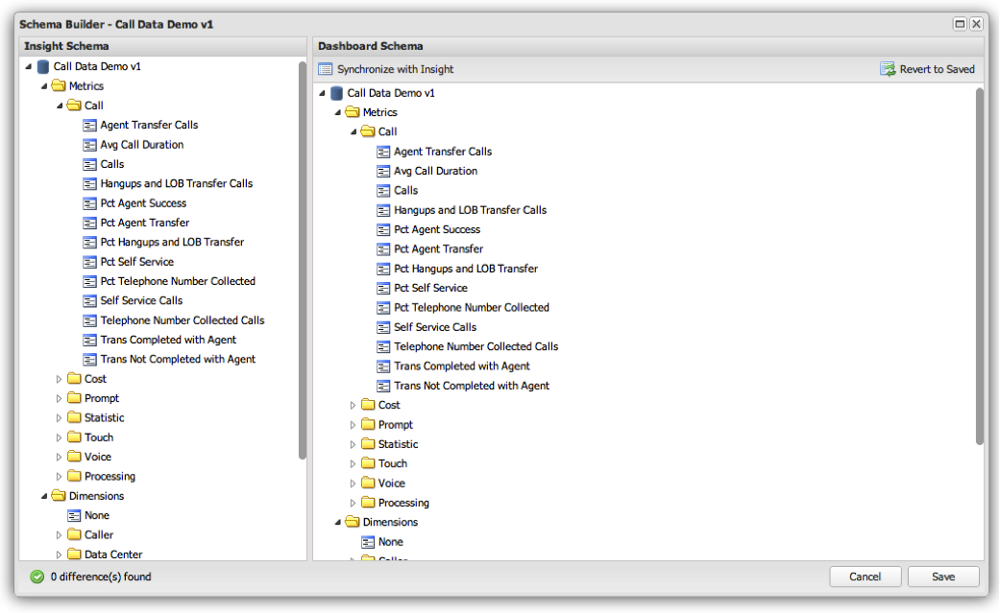

# Hantera schemat{#managing-the-schema}

Schemat som används i Adobe Insight-kontrollpanelen hämtas inte direkt från Insight. Instrumentpanelsadministratören visar i stället vissa objekt från Insight-schemat för slutanvändarna av kontrollpanelssystemet. På så sätt kan administratören bara ge åtkomst till mått, dimensioner och filter som är relevanta för kontrollpanelsanvändare.

Schemahantering utförs med hjälp av **[!UICONTROL Schema Builder]** fönstret i **[!UICONTROL Administration Console]** och är tillgänglig genom att klicka på ikonen till höger om en profilanslutningsrad.

