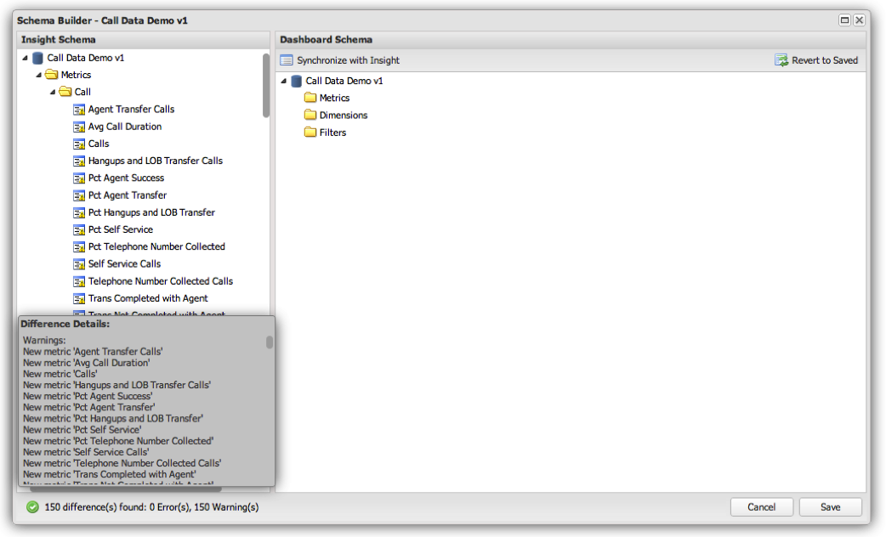

# Initierar och uppdaterar en profils schemadefinition{#initializing-and-updating-a-profile-s-schema-definition}

1. Öppna **[!UICONTROL Schema Builder]** för profilen som du vill konfigurera.
1. Ett **[!UICONTROL Loading]**-meddelande visas när schemat hämtas från Insight-profilen. Hur lång tid det tar att läsa in schemat beror på hur komplex profilen som läses in är.
1. När det är klart visas en sammanfattning av skillnaderna mellan **[!UICONTROL Insight Schema]** i den vänstra rutan och **[!UICONTROL Dashboard Schema]** i den högra rutan. Denna sammanfattning visas i den nedre vänstra delen av **[!UICONTROL Schema Builder]**-fönstret.

   >[!NOTE]
   >
   >När du konfigurerar schemat för första gången visas varje mått, dimension och filter på ett annat sätt än kontrollpanelens schema. Detta beror på att kontrollpanelens schemaobjekt inte finns just nu.

   

1. Klicka på knappen **[!UICONTROL Synchronize with Schema]** om du vill synkronisera alla mått, dimensioner och filter från vyn Insight Schema med vyn Dashboard Schema.
1. När det är klart visas ett meddelande som anger att det inte finns några skillnader:

   

1. Om det finns fel i Dashboard-schemat, t.ex. dubblettmått och mått, måste du korrigera dem manuellt innan du kan spara.

   >[!NOTE]
   >
   >Du kan selektivt ta bort mått, dimensioner eller filter från **[!UICONTROL Dashboard Schema]** som du inte vill ska visas för slutanvändarna av kontrollpanelen. Du får en varning om att det inte finns några objekt i instrumentpanelsschemat, men det kommer inte att hindra dig från att spara.

1. När du är klar klickar du på **[!UICONTROL Save]** för att spara ändringarna i instrumentpanelens schema.
1. Kontrollpanelsystemet använder den här schemadefinitionen för att fylla i de dimensioner, mått och filter som är tillgängliga för slutanvändarna i kontrollpanelsgränssnittet.
