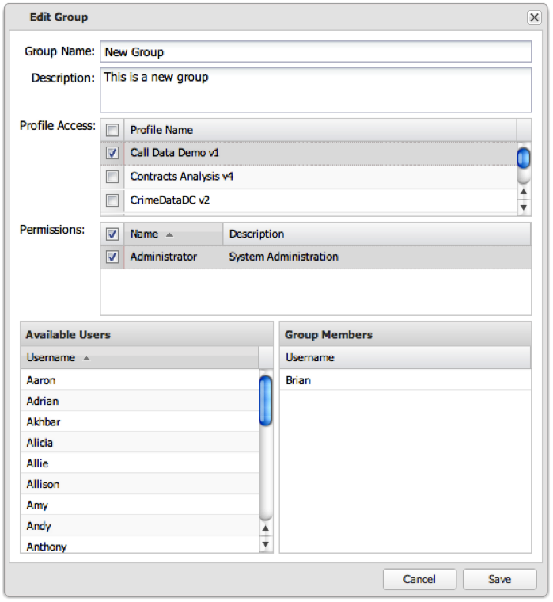

# Redigera en användargrupp{#editing-a-user-group}

1. Klicka på kugghjulsikonen i slutet av raden för att redigera gruppen.

   

1. Redigera gruppens inställningar och klicka på **[!UICONTROL Save]** för att spara ändringarna.

   Om åtgärden lyckades visas ett meddelande om att användargruppen sparades.