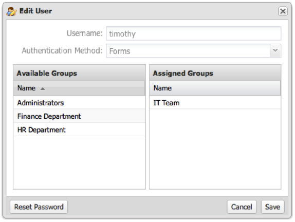

# Redigera ett användarkonto{#editing-a-user-account}

1. Klicka på kugghjulsikonen  i slutet av raden för användaren som du vill redigera

   

1. Redigera användarens kontoinställningar och klicka på **[!UICONTROL Save]**.

   Om åtgärden lyckades visas ett meddelande om att användargruppen sparades.
