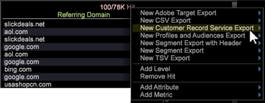

# Exportera till bastjänsterna i Analytics{#exporting-to-analytics-core-services}

Med exportfunktionen i Customer Record Service (CRS) kan ni exportera data Workbench-data till bastjänsterna i Adobe Analytics och integrera dem med andra analysfunktioner, inklusive rapporter och analyser.

>[!NOTE]
>
>För att funktionen för CRS-export ska fungera måste besökarens analys-ID baseras på Experience Cloud ID-tjänsten (ECID). ECID kan vara ifyllt i Data Workbench för en besökare, men om klienten är i respitperioden eller besökarens cookie inte har ersatts med ECID fungerar inte CRS-exporten för den besökaren. Mer information finns i [Identifiera besökares](https://docs.adobe.com/content/help/en/analytics/export/analytics-data-feed/data-feed-contents/datafeeds-visid.html) och [ID-tjänstens giltighetsperiod](https://docs.adobe.com/content/help/en/id-service/using/reference/analytics-reference/grace-period.html).

Från en **detaljtabell** (högerklicka **[!UICONTROL Tools]** > **[!UICONTROL Detail Table]** i en arbetsyta) kan du ange attributvärden och de variabler som krävs för att integrera med Analytics-rapporter och -analyser (med Adobe Pipeline Services).

1. **Högerklicka på tabellrubriken och klicka på Ny kundposttjänst.**

   

1. **Ge exportfilen ett namn och spara.**

   Redigeringsfönstret för exportfilen öppnas.

1. **Öppna** **Fråga > CRS-konfiguration**.
1. **Högerklicka på CRS-attribut > Lägg till ny.**
1. **Ange** ***CRS-*** attributparametrar ****.

   Öppna den nya posten och ange eller verifiera värden i delen *CRS-attribut* i exportfilen:

   

   <table id="table_8156A2C66C0E41D381C31F1082CCA479"> 
    <tbody> 
      <tr> 
      <td colname="col1"> 
<b>Attributnamn</b> 
 </td> 
      <td colname="col2">Namn på variabeln <i>Kundattribut</i> som visas i <i>Rapporter och analyser</i>. </td> 
      </tr> 
      <tr> 
      <td colname="col1"><b>Attributtyp</b> </td> 
      <td colname="col2"> 
Den här parametern accepterar värden för (<i>int</i>, <i>string</i>). 
 
Obs! Om ett attribut <b>inte</b> prenumererar på det i Analytics: 
 
      <ul id="ul_B77BF6FDA3FB4F1BBF9380C2FD938270"> 
       <li id="li_3D099456AF6B4103B227D841C81AB936">Attributet skapas med alla giltiga attributtyper som stöds av Analytics (i den här versionen begränsas det till endast <i>sträng</i> och <i>int</i>). </li> 
       <li id="li_EA1DBDB2E6BE49278C6CD6A5503EDC8A">Om en ogiltig attributtyp anges visas ett felmeddelande om att det inte gick att prenumerera på Analytics. </li> 
      </ul> 
 
Om ett attribut <b>redan</b> prenumereras på i Analytics: 
 
 
      <ul id="ul_16415B639F1C49A5AE9932C128184171"> 
       <li id="li_83C90D44FE5C4D979DEA786660C7F3EC">Var noga med att ange rätt attributtyp för det attribut som redan prenumererar på. </li> 
       <li id="li_02C5024E335C4C59B4F7B0084232CC24">Om du anger fel typ för attributet beror dess beteende på Analytics' hantering av attributtyper. </li> 
      </ul> 
 
 </td> 
      </tr> 
      <tr> 
      <td colname="col1"> 
<b>Fältnamn</b> 
 </td> 
      <td colname="col2">Namnet på dimensionen eller mätvärdet som attributvärdena väljs från. 
Obs! Fältnamnet <i><b>under</b></i> CRS-attribut <i>ska vara detsamma som</i> Utdatafält <b><i>&gt;</i> Fältnamn <i></i></b> (som fylls i automatiskt baserat på det valda attributet). Om <i>fältnamnet</i> är ogiltigt kommer exporten inte att köras. 
 </td> 
      </tr> 
    </tbody> 
   </table>

1. Högerklicka **[!UICONTROL Report Suite]** > **[!UICONTROL Add New]**.
1. Ange **[!UICONTROL Report Suite ID]**.

   Öppna den nya posten och ange eller verifiera värden i delen *Report Suite* i exportfilen:

   <table id="table_A3279CADB74C441DA2E062E2123CE9D4"> 
    <tbody> 
      <tr> 
      <td colname="col1"><b>Report Suite</b> </td> 
      <td colname="col2">ID för rapportsviten i <i>rapporter och analyser</i> som identifierar <i>kundattributsvariablerna</i> som exporteras. 
 
Obs! Med <i>Rapporter och analyser</i> kan du lägga till flera rapportsviter, men med Data Workbench 6.4 kan du bara exportera en enda rapportserie som identifieras vid <i>index 0</i>. 
Rapportsvitens värde som anges i det här fältet är rapportsvitens ID (och inte namnet på rapportsviten). 
 
 
 </td> 
      </tr> 
    </tbody> 
   </table>

1. Ange parametern ECID-fält.

   **ECID-fält**: Namnet på den dimension i din profil som representerar Adobe Experience Cloud-ID:t. Detta är ett obligatoriskt fält och alla ogiltiga dimensionsvärden som anges exporteras inte.

1. (valfritt) Slutför parametern Fält för besöks-ID.

   **Fält** för besökar-ID: Om användaren vill skicka ett annat anpassat ID för en besökare i sina data anger han/hon namnet på dimensionen som representerar det anpassade besökar-ID:t här. Det här är ett valfritt fält och kan lämnas tomt.
