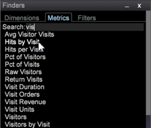

# Findrar{#finders}

Använd Finder-panelerna i Data Workbench för att välja mått, dimensioner och filter. Panelerna har stöd för sökning, sorteringsalternativ samt möjlighet att dra och släppa.

Du kan öppna en Finder-panel i den vänstra sidlisten eller på en arbetsyta.

<table id="table_3E43DBA0646842898F14F31374F9E39C"> 
 <thead> 
  <tr> 
   <th colname="col1" class="entry"> Dimensions Finder </th> 
   <th colname="col2" class="entry"> Metrics Finder </th> 
   <th colname="col3" class="entry"> Filter Finder </th> 
  </tr>
 </thead>
 <tbody> 
  <tr> 
   <td colname="col1"> 
En lista med alla dimensioner i frågemodellen. 
 </td> 
   <td colname="col2"> 
En lista med alla mätvärden i din frågemodell. 
 </td> 
   <td colname="col3"> 
En lista över alla filter som har skapats för din organisation. 
 </td> 
  </tr> 
 </tbody> 
</table>

**Så här öppnar du en Finder:**

* Högerklicka på en arbetsyta och välj **[!UICONTROL Tools]** > **[!UICONTROL Finder]**.

   Fönstret Finder med flikar för Metrisk, Dimensioner och Filter öppnas på arbetsytan.

* Högerklicka i det vänstra sidfältet och välj **[!UICONTROL Add]** > **[!UICONTROL Finder]**.

   Fönstret Finder öppnas i den vänstra panelen.

**Finder** innehåller följande funktioner:

<table id="table_072047E919204577AE85789BAE0F4EE8"> 
 <thead> 
  <tr> 
   <th colname="col1" class="entry"> Funktioner i Finder </th> 
   <th colname="col2" class="entry"> Detaljer </th> 
  </tr>
 </thead>
 <tbody> 
  <tr> 
   <td colname="col1"><b>Dra och släpp</b> </td> 
   <td colname="col2"> 
 Du kan dra och släppa mått eller mätvärden från panelen till en visualisering på arbetsytan för att ändra måtten eller lägga till nya mätvärden. 
 
    <ol id="ol_612DC76EC04C4FCE938B20B388C43CE8"> 
     <li id="li_7F73B781141E4B8CAE9800F580F62E44">Håll ned  &lt;Ctrl&gt; och  &lt;Alt&gt; och välj mått eller mått på panelen Finder. </li> 
     <li id="li_631D57976F71415AA61F33EBBFDD128A">Dra en ny dimension från rutan och släpp den i visualiseringen för att ändra eller lägga till dimensioner. </li> 
     <li id="li_5329FB82225F46EBBE3A996A641058DE">Om du vill lägga till mätvärden drar du ett nytt mätvärde från rutan och släpper det i måtthuvudet för den valda visualiseringen. </li> 
    </ol> 
Detta fungerar för alla relevanta visualiseringar, inklusive tabeller, besökarkluster, korrelationsmatris, punktdiagram och 2D-stapeldiagram (beroende på axeln). 
 </td> 
  </tr> 
  <tr> 
   <td colname="col1"><b>Sök</b> </td> 
   <td colname="col2">I rutan  Sök på panelen Finder kan du filtrera namn på Dimensioner, mått och filter. 
    <ul id="ul_0F6F377E9906472E99008EBE7483F689"> 
     <li id="li_75857895EDB045C8B2960393854B257D"> 
Mönstermatchning (enkel sökning med glob). Börja skriva namnet på en obligatorisk dimension, måttenhet eller filterentitet i sökfältet. Endast matchande strängar som finns någonstans i namnet filtreras och visas i Finders-rutan. 
 
Ange till exempel: 
 <code><b>Search:</b>click</code> 
Du kan få följande resultat i Dimensions Finder: 
 
 
 
Med standardmönstermatchning kan du använda jokertecken, t.ex. . (punkt), "?" och "*" (stjärna). 
 </li> 
     <li id="li_044F9EC1399B44CD81E1852F85137704"> 
Reguljära uttryck. Mer komplexa reguljära uttryck stöds också för utökad sökfunktion. Lägg till prefixet "re:" före söktermen (inga blanksteg) som ska tolkas som ett reguljärt uttryck. 
 
Ange till exempel: 
 <code><b>Search:</b>re.*ip</code> 
Du kan få följande resultat i Dimensions Finder: 
 
 
 </li> 
    </ul> 
Mer detaljerad sökinformation finns i <a href="https://docs.adobe.com/content/help/en/data-workbench/using/dataset/c-reg-exp.html" format="http" scope="external"> reguljära uttryck</a>. 
 </td> 
  </tr> 
  <tr> 
   <td colname="col1"><b>Dimension</b> </td> 
   <td colname="col2">På fliken Dimension kan du högerklicka på tabbrubriken för att sortera efter dimensionstypen. 
 
     <ul id="ul_D36B8474730F4859BC7AA015CC1B8EF0"> 
      <li id="li_4AE1D5699D0E45AF880A134F886B8B19">Attribut - Dimensioner som bygger på besökarens egenskaper, produkter, geografi, tid, video och andra attribut. </li> 
      <li id="li_0B2A08F8CBE94356AC506F95DC268C47">Kluster - Dimensioner som byggts i klusterbyggaren. </li> 
      <li id="li_4BC3396A680B49A4B6BDAAD066826864">Bakgrundsmusik - Dimensioner som är inbyggda i poängen för benägenhet. </li> 
     </ul> 
 </td> 
  </tr> 
  <tr> 
   <td colname="col1"><b>Etikett</b> </td> 
   <td colname="col2">På varje flik kan du högerklicka och välja  Label för att byta namn på Finder-rutan. 
 
 
Standardetiketterna för Dimensioner, mått och filter kan ändras till ett fliknamn som uppfyller organisationens regler. 
 </td> 
  </tr> 
  <tr> 
   <td colname="col1"><b>Lägg till objekt</b> </td> 
   <td colname="col2">På varje flik kan du högerklicka och välja  Lägg till objekt för att öppna en tabell och manuellt lägga till Dimensioner, mått och filter. </td> 
  </tr> 
  <tr> 
   <td colname="col1"><b>Fältet Finders</b> </td> 
   <td colname="col2">Högerklicka i fältet  Finders i det vänstra sidofältet för att öppna en meny för ytterligare funktioner. 
 
 </td> 
  </tr> 
  <tr> 
   <td colname="col1"><b>Stäng</b> </td> 
   <td colname="col2">Högerklicka i fältet  Finders och välj  Stäng för att stänga rutan Finders. </td> 
  </tr> 
  <tr> 
   <td colname="col1"><b>Spara</b> </td> 
   <td colname="col2">Spara listan lokalt genom att högerklicka i sidhuvudsfältet och välja alternativet  Spara. </td> 
  </tr> 
  <tr> 
   <td colname="col1"><b>Exportera</b> </td> 
   <td colname="col2">Du kan exportera en lista med valda mått, mätvärden eller filter från panelen Finder genom att högerklicka i fältet Finders och välja  Export på menyn. 
 Lägg till ett namn och exportera till Microsoft Excel. 
 </td> 
  </tr> 
  <tr> 
   <td colname="col1"><b>Kopiera</b> </td> 
   <td colname="col2"> Kopiera en lista med Dimensioner, mått eller filter. Du kan kopiera som en fil eller som en bild i Mörk bakgrund, Ljus bakgrund eller Monokrom. </td> 
  </tr> 
  <tr> 
   <td colname="col1"><b>Minimera</b> </td> 
   <td colname="col2"> Minimera rutan Finder. Endast fältet Finders visas. </td> 
  </tr> 
  <tr> 
   <td colname="col1"><b>utan kanter</b> </td> 
   <td colname="col2"> Visar en ruta utan kantlinjer för Finders på arbetsytan (men inte i den vänstra sidofältet). </td> 
  </tr> 
 </tbody> 
</table>

