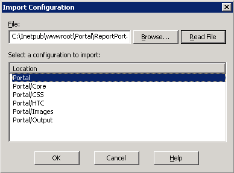

# Mappa rapportportalen till en virtuell katalog (IIS 6.0){#mapping-report-portal-to-a-virtual-directory-iis}

{{eol}}

Steg för att mappa rapportportalen till en virtuell katalog (IIS 6.0).

Mappa [!DNL Report Portal] till en virtuell katalog i IIS 6.0 utför tre olika uppgifter:

1. [Redigera konfigurationsfilen](../../../../home/c-rpt-oview/c-install-rpt-port/c-virtual-dir/c-map-rpt-port-vdir-6.md#section-eaf1c58935074cfa840dac33e1286520)
1. [Importera konfigurationsfilen till IIS](../../../../home/c-rpt-oview/c-install-rpt-port/c-virtual-dir/c-map-rpt-port-vdir-6.md#section-9d61f6bfa93846dcb96973fec5573b19)
1. [Aktivera ASP (Active Server Pages) på IIS](../../../../home/c-rpt-oview/c-install-rpt-port/c-virtual-dir/c-map-rpt-port-vdir-6.md#section-a7725ec2afc64ffc854c5bd8c5c31802)

Du måste slutföra alla tre uppgifterna.

## Redigera konfigurationsfilen {#section-eaf1c58935074cfa840dac33e1286520}

1. På datorn där [!DNL Report Portal] öppnar du \*PortalName*\ReportPortalSetup.xml i en textredigerare som Anteckningar.

1. Använd redigerarens sök-och-ersätt-funktion för att globalt ersätta (Ersätt alla) strängen&quot;VSVirtualPortalName&quot; med namnet på portalen. Om du till exempel vill använda&quot;VisualReportPortal&quot; som namn på [!DNL Report Portal]söker du efter&quot;VSVirtualPortalName&quot; och ersätter den med&quot;VisualReportPortal&quot;.
1. Leta reda på följande element i den här filen:

   ```
   <IIsWebVirtualDir Location= "/LM/W3SVC/1/Root/PortalName/Output" AccessFlags="AccessRead | AccessScript” AppFriendlyName="Output" . . . >
   ```

1. Ange elementets [!DNL Path] attribut till den fysiska platsen för den katalog där [!DNL Report Server] sparar utdata för rapportuppsättningarna.

   Utdatamappen kan finnas var som helst, ha valfritt namn och innehålla en undermapp för varje rapportuppsättning.

   >[!NOTE]
   >
   >Det här måste vara samma katalog som du anger i parametern Utdatarot i [!DNL Report.cfg] för en rapportuppsättning. Mer information finns i [Konfigurera Report.cfg-filer](../../../../home/c-rpt-oview/c-admin-rpt/c-config-rpt-files.md#concept-cf4b95344fcb4c8c877db91e5f1d345d).

   I följande kodexempel visas hur du ställer in [!DNL Path] om dina rapporter har sparats i [!DNL E:\VSReport\ReportOutput]:

   ```
   < . . . 
   AppIsolated="2" 
       AppRoot="/LM/W3SVC/1/Root/PortalName/OutputFolder" 
       DirBrowseFlags="DirBrowseShowDate | DirBrowseShowTime |...  
       Path="E:\VSReport\ReportOutput"
   ```

   >[!NOTE]
   >
   >Det är viktigt att [!DNL Path] -attributet är korrekt.

1. Om du ändrade standardinställningen [!DNL Path] i [!DNL Output] -element, flytta [!DNL profiles.xml] från *\PortalName*\PortalFiles\Output folder to the output directory that you specified in Step 4. I exemplet ovan skulle du flytta [!DNL profiles.xml] till [!DNL E:\VSReport\ReportOutput].

1. Verifiera att [!DNL Path] attribut för alla andra [!DNL IIsWebVirtualDir] -element mappas till rätt plats genom att söka efter alla förekomster av [!DNL C:\Inetpub\wwwroot] och ersätta alla med rätt sökväg.

1. Spara filen. Om du vill bevara originalfilen kan du spara konfigurationsfilen med ett nytt namn.

## Importera konfigurationsfilen till IIS {#section-9d61f6bfa93846dcb96973fec5573b19}

1. På datorn där [!DNL Report Portal] är installerat startar du IIS-hanteraren med **[!UICONTROL Start]** > **[!UICONTROL Administrative Tools]** > **[!UICONTROL Internet Information Systems (IIS) Manager]**.

1. Välj **[!UICONTROL (local computer)]** > **[!UICONTROL Web Sites]** > **[!UICONTROL Default Web Site]**.

1. Högerklicka **[!UICONTROL Default Web Site]** och markera **[!UICONTROL New]** > **[!UICONTROL Virtual Directory]** (från fil).

1. Välj **[!UICONTROL ReportPortalSetup.xml]** och klicka på **[!UICONTROL Read File]**.

1. Verifiera att sex virtuella kataloger är listade för din [!DNL Report Portal] som i följande exempel.

   

   Om du inte ser sex virtuella kataloger eller om du får ett felmeddelande klickar du på **[!UICONTROL Cancel]** och kontrollera om konfigurationsfilen innehåller fel.

1. Markera den första virtuella katalogen i listan (den som är överordnad de övriga fem) och klicka på **[!UICONTROL OK]**. IIS importerar mappningarna och lägger till de virtuella katalogerna på standardwebbplatsen.

   Se till att den resulterande katalogstrukturen har en överordnad mapp (med samma namn som portalen) och fem underkataloger enligt följande exempel.

   

1. Klicka på varje virtuell katalog för att kontrollera att IIS kan hitta den fysiska katalog som den representerar. Om ett fel visas i IIS högerklickar du på den virtuella katalogens namn och kontrollerar att [!DNL Local Path] fältpekar på rätt fysisk katalog.

## Aktivera Active Server Pages (ASP) på IIS {#section-a7725ec2afc64ffc854c5bd8c5c31802}

Används [!DNL Report Portal]måste ASP:er vara aktiverade på IIS. (ASP är som standard inaktiverat när IIS 6.0 är installerat.) Använd följande procedur för att verifiera att ASP är aktiverat på din IIS.

1. I IIS-hanterarfönstret väljer du **[!UICONTROL (local computer)]** > **[!UICONTROL Web Service Extensions]**.
1. Verifiera att [!DNL Active Server Pages] tillägget är inställt på [!DNL Allowed].

   

1. Om deras status är förbjuden väljer du **[!UICONTROL Active Server Pages]** och klicka **[!UICONTROL Allow]**.
1. Stäng IIS-hanteraren.
