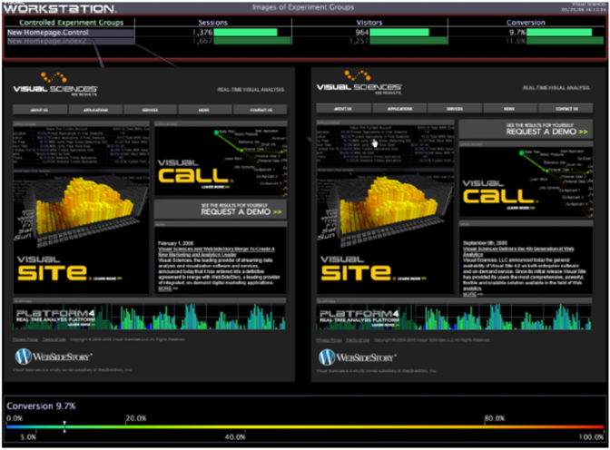

# Utvärdera experimentet{#evaluating-the-experiment}

När du har kört experimentet tills det minsta antal besökare som krävs har deltagit i experimentet kan du vara säker på att du har tillräcklig statistisk tillförlitlighet för att utvärdera resultatet av ditt experiment.

Med [!DNL Insight] jämfördes de mätvärden eller nyckeltal som definierades som en del av hypotesen för att avgöra om experimentet var lyckat (det vill säga hypotesen validerades med det angivna förtroendet).

I vårt exempel på experiment är vår hypotes korrekt om besökskonverteringen ökar med minst 1,5 procent, vilket är det framgångskriterium som vi definierade tidigare.

I följande exempel på arbetsytan visas att konverteringen för testgruppen index2 faktiskt var 1,8 % högre än för kontrollgruppen, vilket bevisar vår hypotes.

* [Sammanfattning av expertresultaten](../../../home/c-undst-ctrld-exp/c-vw-rslts/c-ev-exp.md#section-24a496c080a04e929764094acb00bab7)
* [Agera utifrån resultaten](../../../home/c-undst-ctrld-exp/c-vw-rslts/c-ev-exp.md#section-1623e26ced524fd9beab48ac1f9165d9)
* [Övervaka åtgärder](../../../home/c-undst-ctrld-exp/c-vw-rslts/c-ev-exp.md#section-1954311950c34637800cbd7c0711983f)

## Sammanfatta försöksresultaten {#section-24a496c080a04e929764094acb00bab7}

Med [!DNL Insight] kan du skapa detaljerade rapporter för att sammanfatta och illustrera resultaten av ditt experiment.

Du kan sedan använda dina rapporter, som i följande exempel, för att göra rekommendationer baserade på resultaten, som säkerhetskopieras av den visuella information som du har angett i dina rapporter:

## Vidta åtgärder baserat på resultaten {#section-1623e26ced524fd9beab48ac1f9165d9}

När resultatet är klart kan du börja använda dessa resultat genom att göra ändringar på produktionsnivå på de testade sidorna, tillämpa samma ändringar på andra delar av webbplatsen och se till att du dokumenterar testet, dess resultat och de ändringar du har gjort.

## Övervaka dina åtgärder {#section-1954311950c34637800cbd7c0711983f}

När det kontrollerade försöket är klart och du har implementerat de ändringar du vill ska du fortsätta att övervaka de ändringar du har gjort, till exempel genom att visa valideringsvärden, skapa kontrolldiagram och tillhandahålla instrumentpanelsvärden.

Var alltid beredd att testa din hypotes på nytt om du tror att de ändringar du har testat och gjort inte kan ge de ursprungliga resultaten.
