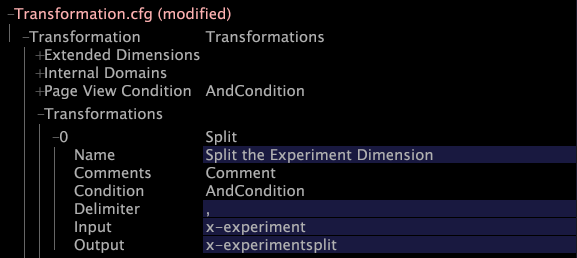

# Ändra Transformation.cfg{#modifying-transformation-cfg}

Nu när x-experimentfältet är tillgängligt måste du skapa en utökad dimension för att inkludera x-experimentfältet i datauppsättningen, så att du kan visa dina resultat i Insight.

Om du vill göra det måste du lägga till en ny dimension i [!DNL Transformation.cfg]-filen.

Om du planerar att köra flera försök måste du även lägga till en ny delad omformning i [!DNL Transformation.cfg]-filen. Den här delade omformningen separerar de olika experimentnamnen och gruppnamnen så att informationen blir lättare att tolka. För att undvika att bearbeta dina data igen om du skulle behöva lägga till fler experiment vid ett senare tillfälle rekommenderar Adobe att du lägger till den delade omvandlingen även om du för närvarande inte planerar att köra flera försök.

I proceduren nedan beskrivs hur du skapar både den nya delade omformningen och den utökade dimensionen. Om du inte vill lägga till den delade omformningen hoppar du bara över steg 5-7.

**Så här ändrar du Transformation.cfg**

1. I [!DNL Insight] öppnar du [!DNL Profile Manager] genom att högerklicka i en arbetsyta och klicka på **[!UICONTROL Admin]** > **[!UICONTROL Profile Manager]**, eller genom att öppna arbetsytan Profilhantering på fliken [!DNL Admin].
1. Klicka på **[!UICONTROL Dataset]** i [!DNL Profile Manager] för att visa innehållet.
1. Högerklicka på bockmarkeringen bredvid [!DNL Transformation.cfg] och klicka på **[!UICONTROL Make Local]**. En bock för den här filen visas i kolumnen [!DNL User].
1. Högerklicka på den nya bockmarkeringen och klicka på **[!UICONTROL Open]** > **[!UICONTROL in Insight]**. Fönstret [!DNL Transformation.cfg] visas.
1. Klicka på **[!UICONTROL Transformation]** för att visa innehållet.
1. Högerklicka på **[!UICONTROL Transformations]** och klicka på **[!UICONTROL Add new]** > **[!UICONTROL Split]**.
1. Slutför den nya delningen vid kommaomformning enligt följande exempel:

   

   >[!NOTE]
   >
   >Du kan ange valfritt värde i fältet Namn.

1. Högerklicka på **[!UICONTROL Extended Dimensions]** och klicka på **[!UICONTROL Add new]** > **[!UICONTROL ManyToMany]**.
1. Slutför den nya dimensionen enligt följande exempel:

   

   >[!NOTE]
   >
   >* Du kan ange valfritt värde i fältet Namn.
   >* Om du inte inkluderade den delade omformningen måste du skriva &quot;x-experiment&quot; i fältet [!DNL Input].

1. Högerklicka på **[!UICONTROL (modified)]** högst upp i fönstret och klicka på **[!UICONTROL Save]**.
1. I [!DNL Profile Manager] högerklickar du på bockmarkeringen för [!DNL Transformation.cfg] i kolumnen [!DNL User] och klickar sedan på **[!UICONTROL Save to]** > **[!UICONTROL profile name]** för att spara de lokalt gjorda ändringarna i arbetsprofilen.

   >[!NOTE]
   >
   >Datauppsättningen börjar omformas omedelbart.

   Mer information om [!DNL Transformation.cfg] och utökade dimensioner finns i *Konfigurationshandboken för datauppsättningar*.
