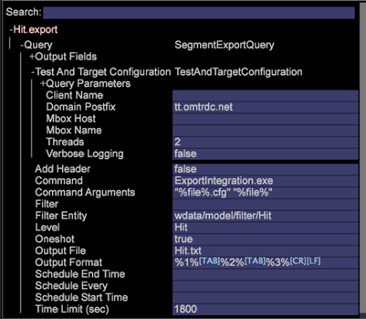

# Integrering av Data Workbench med Adobe Target

Integrationen av Adobe Data Workbench med Adobe Target har blivit enklare tack vare funktionerna i Data Workbench för att exportera datasegment och automatiskt fylla i exportfiler.

Adobe Data Workbench är integrerat med Adobe Target för datautbyte och rapportgenerering. I Data Workbench kan du analysera populationer för meningsfulla segment med hjälp av alla tillgängliga data, inklusive offlinekonverteringar via kanaler som telefon, butik och så vidare.

En besökare söker till exempel efter skor på webbplatsen men konverterar inte. Istället laddar besökaren ned en kupong för 20 procent av nästa inköp och köper sedan en skjorta i din butik. Med Data Workbench kan ni samla in data och sedan överföra profildata tillbaka till Target för att visa att besökaren har köpt en skjorta offline. Sedan kan ni rikta in er på en kampanj som ger besökaren en hink, när Target normalt försöker återmarknadsföra skor till den besökaren.

## Konfigurera Data Workbench med Adobe Target

1. Högerklicka på sidhuvudet i [!UICONTROL Detail Table] fönstret.

   

1. Markera **[!UICONTROL New Target Export]** och ange namnet på en ny exportfil under **[!UICONTROL Save As]** kommandot på menyn.

1. Klicka på **[!UICONTROL Save Export File]**.

   Ett fönster med exportmallar öppnas.

   All Adobe Target-information fylls i automatiskt. Den skapar parameterlistan baserat på vad du placerar i segmentexporten. När det är klart skickar Data Workbench data till Adobe Target-servern.

   **Obs!** Mallfilen bör konfigureras av [!UICONTROL Profile Architect]. Du [!UICONTROL Client Name]måste ange [!UICONTROL Domain Postfix], [!UICONTROL Mbox Host], [!UICONTROL Mbox Name] och. Om du har flera webbplatser kan du fylla i flera mallar och spara dem på servern. Mallarna från Profilhanteraren finns i `Context\FileNew\Detail Table\Export\Copy`.

   

1. Ange [!UICONTROL mboxPC] frågeparametern.

   Om namnet på Data Workbench-attributet är något annat än [!UICONTROL mboxPC]måste du redigera rätt frågeparameter och ändra namnet till _mboxPC_.

   

   När du sparar exportfilen på servern börjar exporten. När det är klart startar programmet och skickar data till Target-kontot. [!UICONTROL TnTSend.exe] Det startas.

## Konfigurera Data Workbench för Target

Utför följande uppgifter i Adobe Target:

Data Workbench skickar användarprofiler till Adobe Target. Om du vill konfigurera för export till Target måste du konfigurera och aktivera dess API och ange **[!UICONTROL clientname]** och **[!UICONTROL domain postfix]** parametrar för exportkonfigurationsfilen (`export.cfg`).

Ett nytt booleskt alternativ med namnet **[!UICONTROL Oneshot]** har lagts till i segmentexportfilerna. Det här alternativet ingår i mallfilen som distribueras med den nya profilen. Om [!UICONTROL Oneshot] är inställt på _true_&#x200B;ändras `.export` filens namn till `.export.done-TIMESTAMP` när exporten är klar, så att segmentet aldrig exporteras mer än en gång. Detta är viktigt när du exporterar till Adobe Target.

**Obs!** Ett anrop från Data Workbench till Adobe Target räknas som ett [!UICONTROL mbox] anrop, vilket kräver ett anrop för varje skickad profil. Följaktligen ökar kostnaderna om det krävs flera samtal mellan de båda lösningarna.

En ofullständig konfiguration ger följande felmeddelande i loggen:

```
TNT-040615-133212-Adobe-Target-Product-Test.log:
TnT Configuration left out these empty fields:
ClientName,MboxHost,MboxName
```

## Konfigurera Adobe Target för Data Workbench

I Adobe Target behövs ingen särskild konfiguration för att en kund ska kunna skicka profildata. Profilinformationen för en användare skickas vanligtvis i den vanliga [!UICONTROL mbox] begäran, och servrarna gör profilparametrarna tillgängliga för en målinriktad kampanjkonfiguration som standardfunktioner utan ytterligare konfiguration.

Adobe Target har inbyggd integrering med Data Workbench, som kan aktiveras från sidan Klientinformation för superanvändare. Om du aktiverar alternativet visas segment som delas från Data Workbench i Adobe Target så att de blir tillgängliga för målinriktning.

## Ange HTTP-loggrapportering i ExportIntegration.exe

Minska den långa rapporteringen till [!UICONTROL HTTP.log] när du exporterar Adobe Target-integreringsfiler [!UICONTROL ExportIntegration.exe] .

Med en ny [!UICONTROL httpLoggingEI.cfg] konfigurationsfil (finns på `server\Admin\Export\httpLoggingEI.cfg`) kan du minska den utförliga loggningen till [!UICONTROL HTTP.log] filen när du exporterar data med [!UICONTROL ExportIntegration.exe]. På så sätt kan du stoppa utförlig loggning av begäranden/svar.

Utförlig loggning finns redan i [!UICONTROL TnTSend.log] filer.

_True_ anger utförlig loggning och _False_ stoppar utförlig loggning till [!UICONTROL HTTP.log] fil.

I inställningen Falskt skickas bara ett varningsmeddelande till [!UICONTROL HTTP.log] filen (Info-innehåll skickas inte).