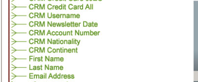
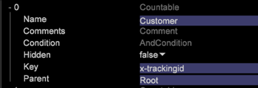

# Räkningsbara strukturer för schemautformning{#schema-design-countable-structures}

Förklaring av Countables i DataWorkbench (DWB) för utformning och implementering av schemat.

## Förstå inventering i Data Workbench {#section-6e6b8d1c17634d669e62c91a80a0bc62}

På den högsta nivån finns räkningsbara dimensioner. Räkningsbara dimensioner har två huvudfunktioner. För det första är de dimensioner vars element du vill räkna. Med andra ord besvarar räknare frågor som:

* Hur många besökare besökte din hemsida?

* Hur många besök kom från Google.com?

`<discoiqbr>`Räknbara dimensioner används vanligtvis för att skapa summavärden som returnerar antalet, eller summan, av alla element i dimensionen. Du kan definiera räkningsbara dimensioner för att räkna instanser som reservationsbokningar eller produktorder. Du kan till exempel definiera de räkningsbara dimensionsordningarna vars element (loggposter som motsvarar order från din onlinebutik) kan räknas. Om du vill visa antalet order i en visualisering definierar du ordersummemätningen, som kan utvärderas över en dimension eller tillämpas på filter.

Räknbara dimensioner kan vara överordnade av andra dimensioner eller underordnade av andra räkningsbara dimensioner.

Även om din räkningsbara rotdimension inte behöver kopplas till spårnings-ID:n i data rekommenderar Adobe att du konfigurerar datamängdens räkningsbara rotdimension så att spårnings-ID-fältet (x-trackingid) används som Key. Därför kopplas varje element i roträkningsbar till ett unikt värde för x-trackingid, och alla data om varje element grupperas tillsammans.

Räknbara dimensioner definieras med följande parametrar:

<table id="table_5E00B72CFDD645368ADCC25AB9B5E53D"> 
 <thead> 
  <tr> 
   <th colname="col1" class="entry"> Parameter </th> 
   <th colname="col2" class="entry"> Beskrivning </th> 
   <th colname="col3" class="entry"> Standard </th> 
  </tr>
 </thead>
 <tbody> 
  <tr> 
   <td colname="col1"> Namn </td> 
   <td colname="col2"> Beskrivande namn på dimensionen som det visas för användaren i data workbench. Dimensionsnamnet får inte innehålla ett bindestreck (-). </td> 
   <td colname="col3"> </td> 
  </tr> 
  <tr> 
   <td colname="col1"> 
Kommentarer 
 </td> 
   <td colname="col2"> 
Valfritt. Noteringar om den utökade dimensionen.

    &lt;/p> &lt;/td>
<td colname="col3"> </td> 
  </tr> 
  <tr> 
   <td colname="col1"> 
Villkor 
 </td> 
   <td colname="col2"> 
De villkor under vilka indatafältet bidrar till att skapa den räkningsbara dimensionen. Om det anges begränsar ett villkor uppsättningen loggposter som är synliga för dimensionen och alla dess underordnade poster i datasetet schema. 
 </td> 
   <td colname="col3"> </td> 
  </tr> 
  <tr> 
   <td colname="col1"> Dold </td> 
   <td colname="col2"> Avgör om dimensionen visas i gränssnittet för data workbench. Som standard är den här parametern inställd på false. Om dimensionen till exempel bara ska användas som bas för ett mätresultat, kan du ställa in den här parametern på true för att dölja dimensionen från data workbench-visningen. </td> 
   <td colname="col3"> falskt </td> 
  </tr> 
  <tr> 
   <td colname="col1"> Nyckel </td> 
   <td colname="col2"> 
Valfritt. Namnet på fältet som ska användas som nyckel. Om du definierar den här parametern finns det ett element i den räkningsbara dimensionen för varje kombination av ett element i den räkningsbara dimensionens överordnade element och ett distinkt värde för fältet som anges som nyckeln. 
 
Varje element i den räkningsbara dimensionen måste relateras till en sammanhängande uppsättning loggposter. Om loggposterna inte ordnas av nyckeln skapas därför ett element i den räkningsbara dimensionen varje gång nyckelfältet ändras. För att förhindra detta rekommenderar Adobe att du använder en unik nyckel som ligger intill varandra i tidsordning. 
 </td> 
   <td colname="col3"> </td> 
  </tr> 
  <tr> 
   <td colname="col1"> Överordnad </td> 
   <td colname="col2"> 
 Namnet på den överordnade dimensionen. Alla räkningsbara dimensioner kan vara en överordnad dimension. Om du vill göra en dimension till den översta nivån i datasetens schema anger du parametern till "root". Den definierade dimensionen blir den räkningsbara rotdimensionen för datauppsättningen. Om du till exempel arbetar med Plats är dimensionen Visitor den räkningsbara rotdimensionen för datauppsättningen. 
 
Obs! Även om din räkningsbara rotdimension inte behöver kopplas till spårnings-ID:n i data rekommenderar Adobe att du konfigurerar datamängdens räkningsbara rotdimension så att spårnings-ID-fältet (x-trackingid) används som Key. Därför kopplas varje element i roträkningsbar till ett unikt värde för x-trackingid, och alla data om varje element grupperas tillsammans. Om du vill konfigurera datauppsättningen på ett annat sätt kontaktar du Adobe. 
 </td> 
   <td colname="col3"> </td> 
  </tr> 
 </tbody> 
</table>

I det här exemplet illustreras definitionen av en räkningsbar dimension med händelsedata som samlats in från webbplatstrafiken. Den räkningsbara dimensionen räknar webbkampanjhändelser i en given session. Förutsättningen är att alla resurser för e-postkampanjer begärs från webbservern med &quot;email=&quot; som en del av cs-uri-query. I exemplet är det antal gånger som besökaren svarar på en e-postkampanj under en given session av intresse, inte det faktiska värdet i fältet cs-uri-query(email).

Den andra större funktionen hos räknare är att de utgör ryggraden i datasetens schemastruktur. Ditt dataschema och alla andra dimensioner är ordnade för att grupperas under och tillhör en räkningsbar enhet. Med andra ord, om vi ser dimensioner som &quot;kategorier&quot;, är räknare det sätt på vilket vi organiserar dessa &quot;kategorier&quot; i grupper.
När dimensioner grupperas under en räkningsbar dimension sägs de vara på&quot;nivån&quot; för den räkningsbara dimensionen. I bilden nedan ser du till exempel att &quot;E-postadress&quot; finns på besökarnivå och att &quot;Webbläsare&quot; finns på besöksnivå. &quot;Överordnad&quot; och &quot;underordnad&quot; avser relationen mellan den räkningsbara och dimensionerna grupperade nedanför den. Besökaren är till exempel&quot;överordnad&quot; till e-postadressen. Omvänt är e-postadressen underordnad besökaren.  

## Skapa räkningsbar i Data Workbench {#section-491f3e8e4fbc429e95d6c97f012a208e}

Gör så här för att skapa räkningsbar i DataWorkbench:

1. Öppna profilhanteraren
1. Skapa en konfigurationsfil under Transformation-mappen och öppna den i arbetsstationen.
1. Under Utökade Dimensioner högerklickar du och väljer Lägg till ny -> Räknbart enligt nedan: 

1. Ange namn för ny räkningsbar. I exemplet nedan definieras kundinventering. Om det är den högsta räkningsbara nivån skriver du roten för den överordnade nivån. 

   Om alternativet Räknbart inte är den översta nivån anger du namnet på den överordnade nivån i det överordnade fältet. I exemplet nedan skapas Enagement Countable och Parent för den här inventeringen är Customer. 

Mer information om arkitekturen för schemadesign, räkningsbara strukturer och offlinedataflödeskonfigurationer finns i [Dataset Schema Interface](https://experienceleague.adobe.com/docs/data-workbench/using/client/admin-ui/c-dtst-sch-intrf.html).
