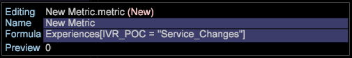

# Mätinställningar{#metrics-setup}

I det här avsnittet beskrivs hur du skapar mätvärden i Data Workbench.

## Förstå mått {#section-f0412e851fcb4ac9886dca4003d42cec}

Mätvärden är kvantitativ information om kundaktivitet, t.ex. vyer, beställningar, antal anrop och intäkter. Mätvärden är grunden för rapporter och hjälper er att visa och förstå datarelationer.

Med Måttdimension kan du gruppera mätvärden efter en viss nivå. Du kan också gruppera mätvärden på en viss nivå.

## Skapa nya mått {#section-60a413899d1b4707965e06fb5ef7fc4e}

Följ stegen nedan för att skapa ett nytt mått:

1. Klicka på **Verktyg** > **Måtredigeraren**.

1. Ange det nya måttnamnet och formeln i måttredigeraren. 

1. Spara den i mappen Metrics. 

## Skapa och redigera härledda mått {#section-ebdcd3ec652f485e90e001d694eab6d0}

Använd en metadataredigerare för att definiera ett nytt mått efter namn, formel och format, som sparas i [!DNL User\profile_name\Metrics] mappen för senare bruk.

1. Öppna en ny mätredigerare med menyalternativet **Admin > Profil** eller genom att högerklicka på kolumnen Användare för den mapp där du vill skapa måttet och klicka på **Skapa > Nytt mått**. En metrisk redigerare visas.

1. I parametern *Namn* skriver du ett namn för det nya måttet.

   >[!NOTE]
   >
   >Observera att mellanslag ( ) tillåts men understreck (_) inte. Du kan inte heller använda följande symboler: + - * /

   

1. Skriv ett uttryck för det nya måttet i parametern *Formel* .

   >[!NOTE]
   Filter måste definieras inom hakparenteser [ ] i uttrycket. Ytterligare syntaxregler för uttryck i metrisk information finns i [Syntax for Metric Expressions.](https://docs.adobe.com/content/help/en/data-workbench/using/client/qry-lang-syntx/c-syntx-mtrc-exp.html)

   Den här tabellen innehåller exempeluttryck för utökade mått. 

   >[!NOTE]
   När ett lämpligt uttryck anges visas värdet för det nya måttet på förhandsvisningsraden. Om det finns ett fel i uttrycket visar förhandsvisningsraden ett felmeddelande.

1. Högerklicka och välj **Spara**. När du sparar måttet skapas en fil som representerar det nya måttet på datorn i DWB- *installationskatalogen \User\profile name\Metrics* .

## Redigera befintliga härledda mått {#section-4b5b7baf885b45cc8b358d1bd774e925}

1. Högerklicka på bockmarkeringen för den metriska fil som du vill redigera i kolumnen Profilhanteraren eller Metrics Manager och klicka sedan på **Skapa lokalt**.
1. Högerklicka på bockmarkeringen för måttfilen i kolumnen Användare och klicka på **Öppna** i workbench.

   >[!NOTE]
   Du kan också öppna en metadataredigerare genom att högerklicka på ett mätningsrelaterat område i en visualisering för att visa mätmenyn.

1. Redigera och spara måttdefinitionen efter behov i **mätredigeraren** med steg 2-4 i *Skapa nya härledda mått*.

   Om du vill att alla användare av profilen ska använda det mått som du redigerade måste du publicera det i arbetsprofilen med hjälp av Profilhanteraren.

Mer hjälp finns i dokumentationen:

[Syntax för måttuttryck](https://docs.adobe.com/content/help/en/data-workbench/using/client/qry-lang-syntx/c-syntx-mtrc-exp.html)

[Skapa och redigera härledda mått](https://docs.adobe.com/content/help/en/data-workbench/using/client/admin-ui/profile-mgr/c-drvd-mtrcs.html)
