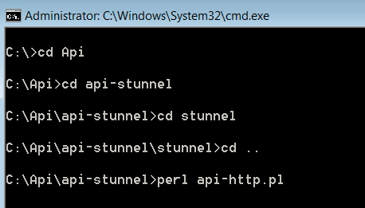

# Inställningar för fråge-API{#query-api-setup}

{{eol}}

En snabbguide för hur du konfigurerar ett Query API.

Följ stegen nedan för att konfigurera Query API:

1. Hämta API-certifikatanskaffning

   Skicka ett e-postmeddelande till Tech Ops Team of Adobe - `Dataworkbench@adobe.com`.

   Ange det CN-namn som du vill använda för fråge-API( anger ett generiskt namn som `<Client>` Fråga-API).

   >[!NOTE]
   >
   >Tech Ops genererar certifikatet och överför det till en URL. Meddela Adobe Consultants när Tech Ops har fått ett meddelande om att biljetten har genererats, så att de kan skicka tillbaka biljetten till dig.

1. Hämtar och extraherar API-tratten. Ta emot en api-stunnel-fil från din konsult.

   Kontrollera att Perl är installerat på datorn.

   I den extraherade mappen (mappsökvägen där du kopierar filen) kopierar du ditt Query API-certifikat inuti *stunnel* mapp.

1. Konfigurera Stunnel.conf

   Det ska finnas en fil som heter *stunnel.conf* inuti *Tunnel* mapp (där du kopierade ditt certifikat).

   Redigera filen i Anteckningar.

   

   Ändra parametrarna enligt följande: 

   Två parametrar måste ändras i den här filen.

   * *Certifikat* = Namnet på ditt certifikat. I det här exemplet är det Aadhithiya Ramani QAPI Client.pem.
   * *Anslut* =Servernamnet för DPU:n.

1. Kopierar *Query.pm*.

   The *Query.pm* -filen kommer att vara tillgänglig i API-mappen för Insight.

   Kopiera *Query.pm* och klistra in den i mappen Perl Library (vanligtvis *C:\Perl64\lib *, men kontrollera var Perl är installerad i datorn).

1. Ändra *api-http.pl* fil

   Filen api-http.pl är tillgänglig i mappen api-stunnel.

   Endast en parameter som ska ändras

   *Min $-profil* = Profilnamnet som du konfigurerar fråge-API:t för.

1. Installera fråge-API:t.

   Öppna kommandotolken som &quot;Administratör&quot; i systemet och gå till den katalog där du extraherade filen *stunnel* som visas: 

   Kör följande kommando *.\stunnel -install*. 

   När kommandot har körts visas ett fönster som anger att *stunnel* är installerat.

   >[!NOTE]
   >
   >När kommandot har körts visas ett fönster som anger att *stunnel* är installerat.

1. Testa Query API-instanskonfigurationen

   Det sista steget i den här processen är att testa konfigurationen av Query API. I kommandotolken som du använde för att installera katalogen api-stunnel. 

   Kör Perl-skriptet som finns i mappen med följande kommando* perl api-http.pl*. 

   När du har kört skriptet ska resultatet se ut som skärmbilden nedan (datum- och resultatvärdena varierar beroende på tidpunkten och andra parametrar i profilen som du har konfigurerat Query API (i steg 6). 
