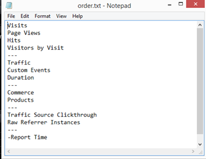

# Konfigurationsändringar för nytt schema{#configuration-changes-for-new-schema}

{{eol}}

I det här dokumentet beskrivs hur du ändrar alla standardkonfigurationer för Data Workbench när det nya schemat har skapats.

## Förstå datauppsättningsschemat {#section-2ffac5170c894781bc943565af7ad479}

Grunden för datauppsättningsschemat består av en nyckeluppsättning relationer som utgör ryggraden i Datans Workbench webbanalysschema. I följande exempel ger ett vanligt webbanalysschema en uppfattning om relationen mellan en besökare, ett besök och en sidvy. 

* En viss besökare kan ha ett eller flera besök.
* Varje besök genereras av endast en besökare.
* Ett visst besök kan omfatta en eller flera sidvisningar.
* En viss sidvy tillhör endast ett besök. `<discoiqbr>`

I takt med att webben och affärsvärlden har utvecklats under årens lopp har även behovet av webb- och dataanalys förändrats. Webbplatser började som platser att titta på innehåll på. Nu kan du titta på innehåll; interaktivt motsvara genom chattar, video eller inskickade data, Köpprodukter. och mycket annat. Dessutom vill företag nu integrera sina webbdata med andra datakanaler i sin verksamhet för att få en bättre bild av verksamheten som helhet. Ett företag kan till exempel vilja integrera sina webb-, call center-, e-post-, sociala medier-, butiks- och kunddata tillsammans. I och med den här integreringen av offline- och onlinekanaler har dataset-scheman utvecklats under de år då två dataset-scheman inte är desamma.

`<discoiqbr>`När du integrerar online- och offlinedata verkar termen&quot;besökare&quot; inte alltid vara lämplig. Därför används ibland termen&quot;kund&quot; i stället för besökaren.  

Nivån Engagement används för att aktivera en enda vy av tiden när du har data från flera datakällor. Anta till exempel att du bara har en datakälla: e-handelsdata som samlats in av besökaraktivitet på er webbplats. I så fall visar besöksnivån besöksbesök på din webbplats från dessa besökare. Observera att tidsdimensionerna &#39;Day&#39;, &#39;Week&#39;, &#39;Month&#39; osv. - som vanligen fångas på &#39;Besök&#39;-nivå.

På samma sätt innebär händelsenivån alla händelser (sidvy, anrop till callcenter osv.) som inträffar under ett ärende. Det kombinerar alla online- och offlinehändelser för en kund under ett engagemang.

## Ny räkningsbar struktur i DWB {#section-b77638ec04e4441cb51c56fd3d4abeb6}

Den nya schemastrukturen ersätter besökaren, Besök efter engagemang och Träd efter händelse. 

## Konfigurationsändringar enligt Nytt datauppsättningsschema {#section-27135515be5c471ba2ee879d1ef4771f}

Om du vill ändra dataschemat från besökare till kund måste du ändra följande konfigurationsfiler:

1. Alla konfigurationsfiler i datamappen där räkningsbara och utökade dimensioner definieras. 

1. Konfigurationsfiler under Dimension-mappen där besökaren, besöket eller händelsen används som nivå.

   Exempel: Filen Campaign.cfg. I Adobe SC-profilen definieras Campaign på besöksnivå. 

   I följande exempel visas en idé om den överordnade schemaändringen från Besök till Engagement: 

1. Eftersom vissa av mätvärdena härleds eller skapas av räknare måste konfigurationsfilerna under Metrics-mappen ändras eller skapas.

   Till exempel: skapa ett nytt mått [!DNL Customers.metric with formula = sum(one,customer)] eller som sidvyer.mått till *definition* på träffnivå. Ändra måttet och ändra sedan nivån till Händelse i stället för Träff.

   Adobe SC Page Views Metirc definierad på Hits-nivå: 

   `<discoiqbr>` `<discoiqbr>`Följande blir måttet för sidvisningar enligt det nya schemat: 

1. Ändra *order.txt* i mätmappen så att den återspeglar nya eller ändrade mätvärden för kunden, engagemanget och händelsen.

   Adobe *SC-ordning.txt* -fil. 

   *Order.txt* fil med nya schemaändringar: 

1. Alla konfigurationsfiler (.vw) under Visualization-mappen ska ändras så att de hänvisar till nya nivåer: Kund, engagemang och evenemang. Till exempel: 2D-processkarta, 3D-processkarta etc.

   Adobe SC URI.vw som standard för 2D-processkarta definieras på Träff-nivå och Besök grupp enligt nedan: 

   Ändringar som ska göras i URI.vw för nytt schema: 
