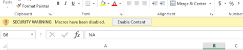

# Inställningar för härledda dimensioner{#derived-dimensions-setup}

De olika typerna av härledda (klientsidans) dimensioner och hur du konfigurerar dem i Data Workbench.

## Typer av härledda dimensioner {#section-33e6dcc9ab9745de9b830cecb2427ca3}

**Måttmått**

Med Måttdimension kan du gruppera mätvärden efter en viss nivå. Du kan också gruppera mätvärden på en viss nivå. När du har skapat en måttdimension kan du segmentera data baserat på måttvärdet.

Exempel 1: Du är ett reseföretag och du vill förstå skillnaden i beteendeaktiviteter på webbplatsen mellan dina flygblad och kunder som har bokat flygresan mindre än fem gånger, hur skulle du göra det?

Allt ni har är att räkna bokningar som mätvärden, hur segmenterar ni kunder utifrån en mätmetod - här, bokning - för att förstå deras beteende på webbplatsen?

Exempel 2: Du är en bank och du vill gruppera dina kunder baserat på hur många cd-skivor de har investerat i. Ni vill segmentera kunderna på tre nivåer. Steg 1 - Kunder med över 10 CD-skivor, nivå 2 - Kunder med >5 och &lt;10 CD-skivor och nivå 3 -Kunder med >0 och &lt;5 CD-skivor

Den information du har är mätvärden som ger dig antal CD-investeringar - hur skapar du Trött kundsegment för din analys?

*Skapa mått - via arbetsstationen*

Markera en av OOB-måttdimensionerna som lokal och byt namn på dimensionen med ett anpassat namn/Skapa lokal kopia av RenameDim.example och byt namn på den till rätt dimensionsnamn med tillägget .dim

Öppna den nya dimensionen i arbetsstationen för att göra ändringar. Ändra följande parametrar för måttdimensionen baserat på kraven: 

Mått - Mått som ska grupperas

Nivå - Nivå som mätvärden grupperas på

Bucketstart - Startelementet för måttdimensionen. Ange samma värde i förskjutning.

Bucket Size - Grouping size of metric. Ange samma värde i skalan

Antal hakparenteser - maximalt antal element som ska visas i dimensionen

Spara den nya dimensionen på servern om du vill dela den med andra.

**Prefixdimensioner**

Huvudsyftet med dimensionen Prefix är att gruppera element i den ursprungliga dimensionen och att ge användarvänliga namn till grupperade element.

Du äger till exempel en detaljhandelsplats och din webbplats har olika webbplatsavsnitt, t.ex. Women&#39;s Apparel, Men&#39;s Apparel, Toys and Games, Home Decor osv., och var och en av dessa webbplatsavsnitt har flera sidor kopplade till sig. Ni vill göra sökvägsanalys och få insikter om trafiken från en webbplatssektion till en annan och så vidare. Om du använder URI-dimensionen måste du hämta varje sida i varje webbplatsavsnitt i sökvägsläsaren eller processkartan och fortsätta med analysen.

Samma analys kan göras enkelt om det finns en Prefix-dimension med sidor från ett webbplatsavsnitt grupperade som ett enskilt element.

Skapar prefixdimension:

Öppna en 2D-processkarta på menyn Visualisering.

Ändra följande parametrar för prefixdimensionen baserat på kraven.

Ändra kartdimension - Den dimension som du vill använda för 2D-processmappning (t.ex.: SMS-typologi)

Ändra kartnivådimension - nivån för den ovannämnda dimensionen

Ändra kartklippsdimension - den räkningsbara nivå där du vill titta på data.

Ändra kartmått - Det mått som du vill titta på.

När 2D-processkartan är inställd öppnar du den dimension som du nämnde i parametern Ändra kartdimension.

Markera de element som du vill gruppera. Använd CTRL+ALT och dra och släpp elementen på processkartan.

Högerklicka på den punkt som visas och byt namn på gruppen. Om du har markerat 3 element som ska grupperas blir standardnamnet 3 Markerat.

Högerklicka på dispositionen av visualiseringen och spara dimensionen på menyn som visas.

**Ändra namn på dimensioner**

Byt namn på dimensioner skapas av en befintlig dimension. Huvudsyftet med dimensionen Byt namn är att ge dimensionens element användarvänliga namn. Utsidan av rutan Byt namn är siddimensionen som skapas av URI-dimensionen. URI-dimensionen kan vara förvirrande för en person som inte känner till sidornas tekniska namn och det är därför du kan byta namn på element i URI-dimensionen med siddimensionen.

SKAPA ANPASSADE DIMENSIONER FÖR ÄNDRING AV NAMN:

Elementen i den ändrade dimensionen har en 1:1-mappning med elementen i den ursprungliga basdimensionen. Du kan verifiera detta genom att öppna dim-filen för Ändra namn på dimension i arbetsstation/anteckningsrutan. Du kommer att märka att varje element i den ursprungliga dimensionen endast har ett värde (Byt namn på sträng) i filen.

Om du har färre element för att byta namn, Du kan skapa en dim-fil på arbetsstationen och ändra namn på de enskilda elementen enligt stegen nedan.

Steg för att skapa en dim-fil för en Ändra namn på dimension - Använda arbetsstationen

Använd det här alternativet om antalet element som ska namnändras är färre.

1. Öppna en tom arbetsyta och öppna Dimensions Manager. Högerklicka>Admin>Profil>Profilhanteraren.
1. Expandera mappen Dimensions i kolumnen File.
1. Expandera sidmappen i kolumnen Arkiv och högerklicka på filen Page.dim i kolumnen Sekunder till sista (kolumnen representerar vanligtvis profilnamnet) och klicka på alternativet Gör lokal.
1. Högerklicka på Page.dim i kolumnen &quot;User&quot; och klicka på alternativet Copy och klistra in den kopierade .dim-filen i den önskade mappen i Dimensions-katalogen.
1. Klicka på OK i felmeddelandet.
1. Nu kommer du att märka att det finns två Page.dim-filer i mappen Dimensions. Den ena är den ursprungliga filen i katalogen Dimensions\Page och den andra kopierar du som du just klistrar in i steg 4.
1. Högerklicka på den senast inklistrade Page.dim-filen under kolumnen Användare och klicka på den blå/grå inmatningsrutan Page.dim. Inmatningsrutan blir grön med markören blinkande, vilket anger att den kan ändras. Skriv namnet på den Byt namn på dimension som du vill skapa.
1. Du kommer att märka att filen Page.dim i kolumnen File har ändrats till det nya filnamnet som du angav i steg 7. Högerklicka på filen new.dim i kolumnen Användare (sista kolumnen) och välj Öppna > I arbetsstation.
1. När .dim-filen har öppnats på arbetsstationen, klicka på plustecknet (+) bredvid enheten och expandera den. Observera värdet som finns i fältet &quot;Överordnad&quot;, det reflekterar dimensionen &quot;URI&quot;. Det visar&quot;wdata/model/dim/URI&quot; Klicka på den blå/grå indatarutan för att ändra URI:n till namnet på dimensionen vars element du vill byta namn på.
1. Kontrollera att den dimension som du vill byta namn på finns i datauppsättningen. Dimensionsnamn är skiftlägeskänsliga, så behåll skiftläget för den ursprungliga dimensionen.
1. Lägg märke till att &quot;ändrat&quot; visas bredvid dimensionsnamnet. Detta anger att den ursprungliga dimensionen har ändrats. Att behålla de ändringar som gjorts i steg 9. Högerklicka på new.dim (ändrad) och klicka på alternativet Spara som.
1. När dimensionen har sparats per steg 10 är den nya namnändringsdimensionen för kampanjer nu tillgänglig för dig för namnbyte. Detta är endast tillgängligt lokalt.
1. För att andra ska kunna se den dimension som du har skapat måste den sparas i profilen. Högerklicka på dim-filen för den nya dimensionen i kolumnen &quot;Användare&quot; (sista kolumnen) och klicka på &quot;Spara till>profilnamn&quot; där du vill spara dimensionen.
1. När du har sparat filen i profilen kan alla arbetsstationsanvändare som har tillgång till den här profilen se namnändringsdimensionen för kampanjerna.

Verktyget för att skapa prefix och byta namn på toning

Adobe har ett Excel-verktyg för att generera Prefix och Ändra namn på dimensioner.

Nedan följer stegen för att generera måtten Prefix/Byt namn med verktyget:

1. Spara Excel-verktyget *Adobe_DWB_Dimension_Generator.xlsm* i en mapp. Kontakta Adobes kundtjänst om du vill hämta verktyget.
1. Öppna verktyget och aktivera makron: 

1. Fyll databladet med de värden som ska användas.

   Vi skapar t.ex. en produktprofilsprefixdimension som baseras på produktdimension. I databladet hämtas följande information: 

   Varje produkt tilldelas ett varumärke i databladet.

1. Fyll i informationen om dimensionen som ska skapas på fliken Konfiguration. För exempeldata som anges nedan anges information: 

   Namn: Namn på prefix-/Byt namn-dimensionen

   Typ: Prefix/Byt namn

   Källdim: Ursprunglig dimension

   Matcha kolumn: Kolumn som ska matchas

   Resultatkolumn: Värde som ska användas för ny dimension.

1. Klicka på knappen *Klicka här*. 

1. Tona ned-filen genereras i samma mapp som verktyget sparades i. 

   Använd Profilhanteraren och spara dim-filen i mappen Dimension.

**Skift-dimensioner**

Med Skift-dimensioner kan du titta på det n:e elementet i en dimension i en viss räkningsbar dimension.

De ger dig även möjlighet att titta tillbaka på -n-elementet av valfri dimension inom en viss Räkningsbar dimension

Exempel 1:

* Den n:e sidan i en session -Nästa siddimension
* Den n:e sidan för en besökare -Nästa sida för besökare -över alla sessioner
* Det n:e anropet till en användare

Varför är det viktigt att känna till Nth-elementet i den räkningsbara dimensionen?

* Du vill känna till den femte sidan som visas i en session.
* Vill du göra sökningar i kampanjer för att förstå vilken andra kampanj som visades efter att kampanjen&quot;Konto för kostnadsfri kontroll&quot; visats?
* Vill du veta vilken länkbesökare som klickade innan du klickade på Chatta med en agent? 

Nästa URI är en av OOB Shift-dimensionerna som kan användas som mall. Exemplet ovan ger dig elementet 2nd(Offset = 1) i Campaign (Dim = Campaign) i Engagement Event (Clip = Engagement Event)

Här betyder förskjutning 1 att du kan titta åt höger framåt i händelsen

Andra OOB-flyttningsdimensioner

*Nästa sida:*

Nästa sida som visas i en session efter den valda sidan i siddimensionen

Den här förskjutningen är 1, Nivå är Sidvy, Tona är sida och Klippet är session

*Föregående sida:*

Föregående sida visades i en session före den valda sidan i siddimensionen

Den här förskjutningen är -1, Nivå är Sidvy, Tona är sida och Klippet är session

Vad kommer den tidigare kampanjen att visas innan den för närvarande väljs av en besökare?

Den här förskjutningen är -1, Nivå är kampanjsvar, Dim är ett attributvärde för kampanjsvar och Clip är Visitor

*Skapa skifttdimension - via arbetsstation*

* Markera en av OOB-skiftdimensionerna som lokal
* Byt namn på dimensionen med ett anpassat namn
* Öppna den nyskapade dimensionen i arbetsstationen för att göra ändringar
* Ändra följande parametrar för måttdimensionen baserat på kraven.

   * Nivåräkningsbar dimension
   * Förskjutning - Du vill se framåt bakåt
   * Dimma - Dimension vars element du vill analysera
   * Det går att räkna klipp i som du vill visa.

* Spara den nya dimensionen på servern om du vill dela den med andra.

**Senaste N-dimension**

Senaste N-dimensioner fungerar bara på tidsdimensionen och på Från och med-tiden för systemet. OOB-tidsmåtten är dag, vecka, timme och månad. Du kan skapa dimensionen Last N för var och en av dessa grundtidsdimensioner, som de senaste 10 dagarna, de senaste 72 timmarna, de senaste 8 veckorna, de senaste 6 månaderna osv. Senaste N-dimension beräknar Senaste N baserat på systemets aktuella rapporttidsmått eller Från och med. 

Antal - Totalt antal element som ska visas i dimensionen

Intervallförskjutning - förskjutningsvärde som anger startpunkten (dag/vecka) för beräkning av den sista N-dagen/veckan.

**Ingen.dim**

None.dim är en Alias-dimension. Den används för att skapa alias från utökade dimensioner.

Exempel:

I filen None.dim definieras entiteten som &quot;wdata/model/dim/Parent/+name&quot; (den kan ändras), vilket innebär att dimensionen skapas utifrån namnet på dimensionsfilen. Om vi skapar en kopia av filen None.dim under mappen Dimension (till exempel kopiering och namnändring av filen None.dim under mappen Visitor Profile) och byter namn på den till &quot;Log Source ID.dim&quot;, visas en ny härledd dimension med Log Source ID på menyn under Visitor Profile enligt nedan:

Före ändringar: 

Efter inga.dim-ändringar: 

Enheten kan ändras till det utökade dimensionsnamnet, i det här fallet en annan dimension med ett annat namn som pekar på samma dimension som visas nedan:

I det här exemplet har &quot;Source Name.dim&quot; följande innehåll: 

Ett annat namn på dimensionskällan som pekar på Loggkälla-ID visas. 

**Dölja härledda dimensioner**

Om du vill dölja den härledda dimensionen anger du egenskapen *Visa* till &quot;false&quot;. 

