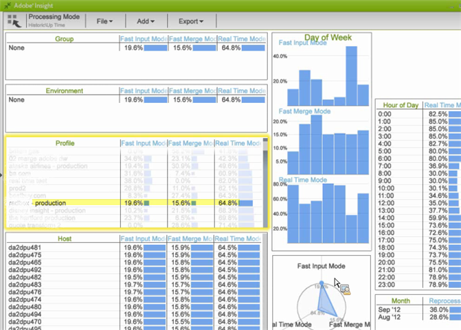

# Arbetsytan Historik för Data Workbench{#data-workbench-historic-workspace}

Använd den historiska profilen för data workbench för att se hur konfiguration, maskinvara och andra förändringar påverkar prestanda, stabilitet och serverkapacitet över tid.

Den historiska profilen innehåller en profilbaserad [profilbaserad](../../../home/monitoring-installation/monitoring-profiles/monitoring-historical-using.md#section-184a86f9de054970bf68515bb9dea85d) datauppsättning för prestanda och den serverbaserade datauppsättningen för [serverprestanda](../../../home/monitoring-installation/monitoring-profiles/monitoring-historical-using.md#section-5dad5870384b40e094d50173fcd90a09) på **[!UICONTROL Performance]** fliken. Det här är de vanligaste datauppsättningarna som visas för ett tidigare perspektiv av data workbench-serverns prestanda. Du kan även visa [Komponenter](../../../home/monitoring-installation/monitoring-profiles/monitoring-historical-using.md#section-5be7223abb384784bafe7b37c764ea66) och [Bearbetningsläge](../../../home/monitoring-installation/monitoring-profiles/monitoring-historical-using.md#section-5be7223abb384784bafe7b37c764ea66) genom att välja **[!UICONTROL Up Time]** -fliken.

Du kan även visa [Komponenter](../../../home/monitoring-installation/monitoring-profiles/monitoring-historical-using.md#section-5be7223abb384784bafe7b37c764ea66) och [Bearbetningsläge](../../../home/monitoring-installation/monitoring-profiles/monitoring-historical-using.md#section-5be7223abb384784bafe7b37c764ea66) genom att välja **[!UICONTROL Up Time]** -fliken.

Mer referensinformation om de dimensioner som används i den historiska profilen för data workbench finns i [Dimensioner i den historiska profilen för insikt.](../../../home/monitoring-installation/monitoring-appendix/monitoring-historical.md#concept-a42837c9c9274f83ad5bc5a6720f02b0)

## Profilprestanda, arbetsyta {#section-184a86f9de054970bf68515bb9dea85d}

Den här datamängden innehåller följande relevanta mått för övervakning av data workbench.

* Snabb inmatning av megabyte per minut - mätvärden visar stora datainmatningar under den inledande loggbearbetningen.
* Snabb sammanslagning av megabyte per minut - mätvärden som visar omformning.

>[!NOTE]
>
>Om du vill göra en riktig prestandautvärdering av din profil ska du titta på priset i stället för den förflutna kalendertiden. Frekvensen mäts som de ändrade värdena mellan avsökningen var tionde minut.

## Arbetsyta för serverprestanda {#section-5dad5870384b40e094d50173fcd90a09}

Den här datauppsättningen övervakar servermått utanför omfånget för inkluderade profiler och innehåller följande relevanta servermått för övervakning av data workbench-data.

* Ungefärliga minuter - beräknad frågelösningstid.
* Poll Latency Milliseconds - Indikator på hur upptagen programvara är genom att mäta hur lång tid det tar att ta sig igenom en komplett serie service för varje komponent.

## Arbetsytan Komponenter {#section-5be7223abb384784bafe7b37c764ea66}

Den här datauppsättningen finns under fliken Starttid.

Komponentdatamängden innehåller två aspekter för komponenthälsa:

* Kommunikationsmått - svarade data workbench-serverprocessen?
* Alla komponentmått - Överst på sidan Detaljerad status finns en lista över komponenter som värden hanterar i data workbench-serverprocesserna. Om en komponent är i ett feltillstånd visas den under Komponenter i feltabellen.

## Arbetsytan Bearbetningsläge {#section-3e1dedb9474e4b4ba513240943e76817}

Den här arbetsytan finns under fliken Starttid. På den här arbetsytan kan du se hur mycket tid som tas i snabb inmatning, snabb sammanslagning och realtidsläge.

Den här datauppsättningen ger viktiga egenskaper för serverbelastning, som att identifiera datainläsning för

* Veckodag (t.ex. en snabb ingångsfrekvens på tisdag och onsdag),
* Timme på dagen (hur stor procentandel av dagen är det i läget Snabb inmatning?)

