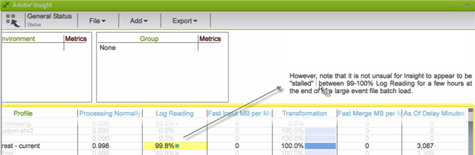

# Datans Workbench profilstatus-arbetsyta{#data-workbench-profile-status-workspace}

Statusprofilen för data workbench-profilen ger aktuell information om tillståndet för data workbench-servern baserat på profilen i stället för servermått eller historiska data.

## Datans Workbench profilstatus {#section-65d1fa393cfd450cbacef3cba823fcc1}

Den här statusprofilen ger den aktuella data workbench-serverinformationen, men inte helt i realtid, eftersom agenten avfrågas var tionde minut och rapporteringen alltid innehåller denna fördröjning på tio minuter. Mer exakt är att de datauppsättningar som genereras av den här profilen ger den senaste observationen av servern från agenten, som oftast har en standardavsökningsperiod på tio minuter.

Mer referensinformation om de dimensioner som används i data workbench Profile Status Profile finns i [Statusprofil för insight Profile](../../../home/monitoring-installation/monitoring-profiles/monitoring-profile-using.md#concept-d4cd7da41c8a42bab4aea25418264e64).

Den här rapporten är mer till för övervakning av åtgärder än komponenter eller specifika trafikfluktuationer.

Det ger oss en känsla av vem som är i vilket läge: Om vi ser en hög snabb ingångsfrekvens för en viss profil är den profilen i läget Snabb ingång.

Om det fasta måttet är 1 kommer servern att stängas av. Om värdet är 0, är servern inte avstängd.

**Loggläsning för stora batchladdningar**

